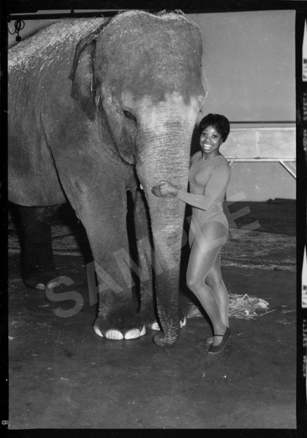
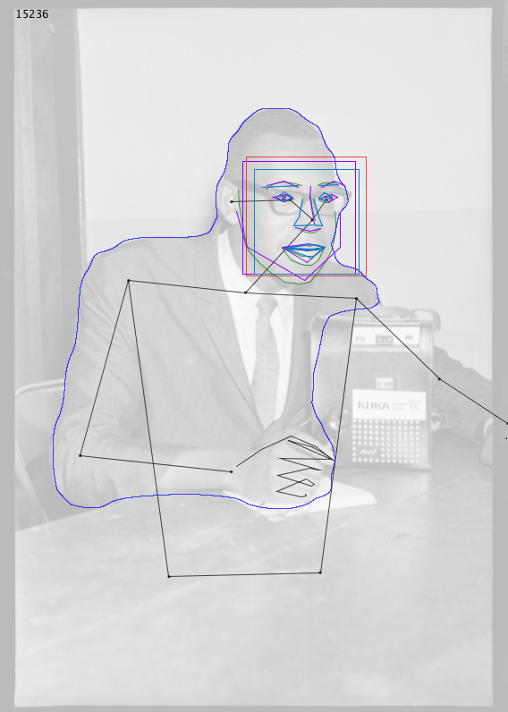
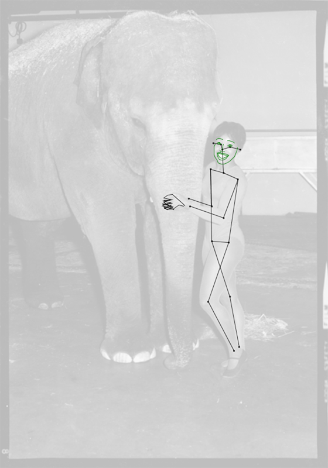
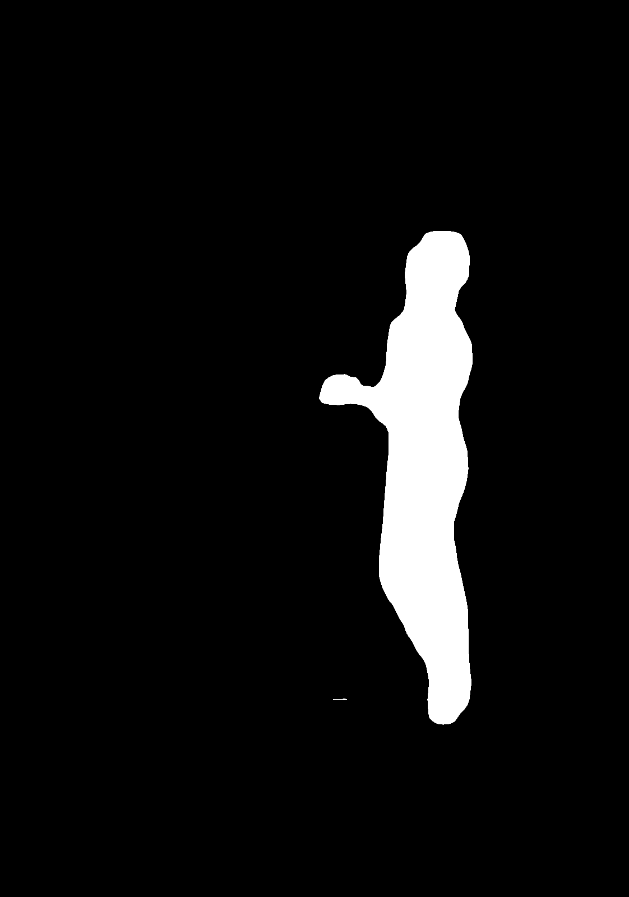
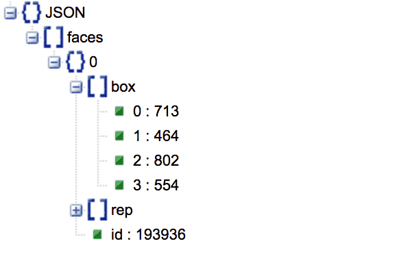
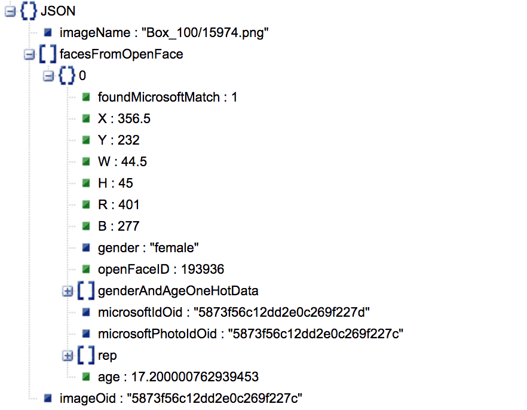
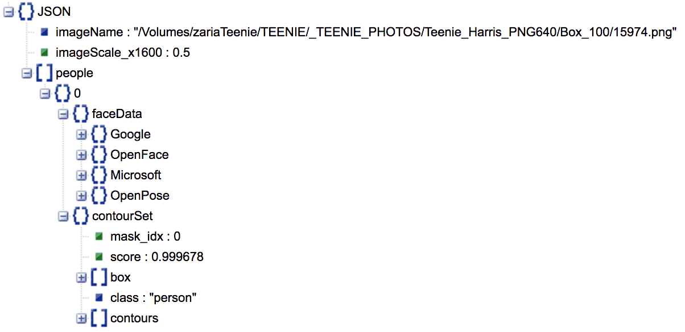
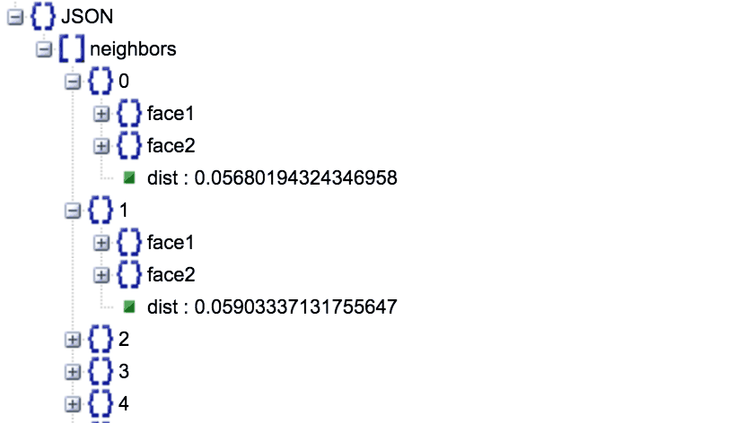
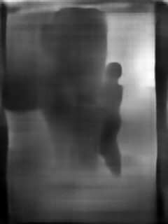
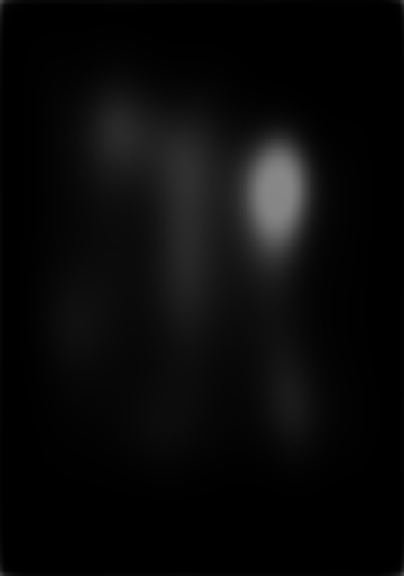

## Teenie Harris Dataset Documentation

#### This document provides information about, and links to, key data resources for the CMU+CMoA Teenie Harris Archive Analysis Project. 

The majority of the resources described here are of two main types: 
* JSON and TSV files that provide numeric and label descriptions the content of photos (such as the coordinates of faces, identified object tags, etcetera).
* PNG image files and NPY (Numpy) binary archives of images, which contain pixelwise information about corresponding photographs (such as estimates of an image's depth, saliency, etc.).

<br />
*Woman with Elephant* (image file #15974) by Charles 'Teenie' Harris


---
### Table of Contents

* [Teenie Harris Files](#teenie-harris-files)
* API Markup Layers
* [Imagga API](#imagga-api)
* Google Vision API
* Microsoft Cognitive Services API
* OpenPose
* Detectron
* OpenFace
* OpenFace+Microsoft
* Analysis / People-in-Images
* Analysis / Other
* Face Ellipses
* Depth
* Saliency
* DCNN
* Embeddings
* Assignments
* Credits

---
### Teenie Harris Files

* ```canonical_filename_order.txt``` [[**1.1MB .TXT**](photos/canonical_filename_order.txt)]
  * 59,278 rows listing the "canonical order" we are using for the Teenie Harris image filenames. 
* ```photos_images_32x32.npy``` [[**57.89 MB .NPY**](https://storage.googleapis.com/teenieharris/photos/npy32/photos_images_32x32.npy)]
  * Extremely low-resolution (32x32 pixel) versions of the archive photos, encoded into a single Numpy binary file. 

---
### API Markup Layers

*This image shows some of the markup layers calculated by various APIs and codebases, including body contours, face landmarks, and estimated skeletons.*

<br />
*Image #15236* by Charles 'Teenie' Harris

* BLACK  - skeletons from OpenPose
* GREEN  - face details from OpenPose
* BLUE   - people contours from Detectron
* RED    - face boxes from OpenFace
* PURPLE - face details from GoogleVision
* CYAN   - face details from Microsoft Cognitive services

---
### Imagga API

*Analysis of the Teenie Harris archive using the [Imagga](https://imagga.com/) image analysis service, including a wide range of semantic descriptors and confidence values.*

* ```imagga_analyses_of_teenie_harris_archive.zip``` [[**106MB ZIP**](https://storage.googleapis.com/teenieharris/imagga/json/imagga_analyses_of_teenie_harris_archive.zip)]
  * Zip archive containing 59,190 JSON files. Input images were 1600 pixels in their maximum dimension.
  * [Example JSON file](imagga/json/result_Box_100_15974.png.json).

---
### Google Vision API

*Results of analysis using the Google Vision API on the TeenieHarris 1600-pixel PNG images. Information includes face landmarks, object recognition, facial expression analysis, and optical character recognition (OCR).*

* ```google_analyses_of_teenie_harris_archive.zip``` [[**321.21MB .ZIP**](https://storage.googleapis.com/teenieharris/google/json/google_analyses_of_teenie_harris_archive.zip)]
  * ZIP archive containing 59,278 JSON files, each describing a corresponding  Teenie Harris image. Input images were 1600 pixels in their maximum dimension. 
  * [Example JSON file](google/json/visionResult_Box100_15974.json).

---
### Microsoft Cognitive Services API

*Results of analyzing the Teenie Harris Archive with the [Microsoft Cognitive Services API](https://azure.microsoft.com/en-us/services/cognitive-services/), which provides information like face landmarks, gender estimation, age estimation, face expression ("emotion") estimation, etc.*

* ```microsoft_json_faces.zip``` [[**114.26 MB**](https://storage.googleapis.com/teenieharris/microsoft/json/microsoft_json_faces.zip)]
  * 59,272 JSON files produced by Microsoft Cognitive Services.
  * [Example JSON file](microsoft/json/msft_15974.png.json)
* ```faces.bson.zip``` [[**79.64 MB .BSON**](https://storage.googleapis.com/teenieharris/microsoft/bson/faces.bson.zip)]
  * Single .BSON ("Binary JSON") file, a flat file created by MongoDB containing all of the Microsoft face data.
* ```faces.metadata.json``` [[**84 bytes**](https://storage.googleapis.com/teenieharris/microsoft/bson/faces.metadata.json)]
* ```imageOidAssociationTable.tsv.zip``` [[**427.79 KB**](https://storage.googleapis.com/teenieharris/microsoft/tsv/imageOidAssociationTable.tsv.zip)]
  * This is a zipped .TSV (tab-separated value) file which links the Archive's box and image filenames to the imageOid UUID from the Microsoft database. The head of the file looks like this: 
  
```
imageBox	imageName	imageOid
Box_001	686.png	583dfcfd1841423bb565ee29
```

---
### OpenPose

*Results from the CMU Perceptual Computing Lab's [OpenPose](https://github.com/CMU-Perceptual-Computing-Lab/openpose) (version 1.2) skeleton analysis, computed across the Teenie Harris archive. The data includes (2D) body skeletons, face landmarks, and hands.*

<br />*OpenPose skeleton data in Image #15974.*

* ```openpose_json.zip``` [[**368.97 MB .ZIP**](https://storage.googleapis.com/teenieharris/openpose/json/openpose_json.zip)]
  * 59,278 JSON files containing skeletons (etc.) corresponding to images in the Teenie Harris photo archive.
  * [Example JSON file](openpose/json/15974_keypoints.json)

---
### Detectron

*Distillation of multi-category object detection using the [Facebook Detectron/COCO](https://github.com/facebookresearch/Detectron) object detector.*

<br />*Detectron contours in Image #15974.*

* ```detectron_categories.txt``` [[**1kb .TXT**](detectron/detectron_categories.txt)]
  * The ordered list of 80 Detectron/COCO categories, taken from [here](https://gist.github.com/AruniRC/7b3dadd004da04c80198557db5da4bda).
* ```teenie_detectron_json.zip``` [[**2.36GB ZIP**](https://storage.googleapis.com/teenieharris/detectron/json/teenie_detectron_json.zip)]
  * Zip archive containing 58,696 JSON files. Each JSON file containins contours of objects (and their category labels) calculated by the Facebook Detectron system. This includes non-person contours. Contour vertex coordinates are scaled to input images whose maximum dimension was 1600 pixels. 
  * [Example JSON file](detectron/json/15974.json)
* ```detectron_rendered_contours_1600px.zip``` [[**583.77MB .ZIP**](https://storage.googleapis.com/teenieharris/detectron/png1600/detectron_rendered_contours_1600px.zip)]
  * Zip archive containing 58,696 .PNG files, each of which displays (in white pixels on a black background) the contours of people (exclusively) in the correspondingly-named Teenie Harris image. *Only contours of people are shown.* All images are scaled to 1600 pixels in their maximum dimension.
  * [Example PNG file](detectron/png1600/15974.png)
* ```images.npy``` [[**57.89MB Numpy file**](https://storage.googleapis.com/teenieharris/detectron/npy32/images.npy)]
  * Numpy binary file containing containing 59,278 .PNG files, which are 32x32 pixel versions of the rendered contour images (produced through a scaled-down centered inner crop). 
* ```canonical_detectron_category_scores_59278rows.tsv``` [[**1.24MB ZIP**](https://storage.googleapis.com/teenieharris/detectron/tsv/canonical_detectron_category_scores_59278rows.tsv.zip)]
  * This file reports, for every Teenie Harris image, the confidence scores (0...1) that each of the Detectron categories appears in that image.
  * In cases where an image contains more than one detected object with that class category, this file reports the *maximum* confidence score encountered in that image. 
  * The rows of this file are in "canonical order", meaning, the sorted according to the *canonical list of files*. This canonical list (generated via 'natural sorting' can be found [here](processing_code/DetectronCategorizerReorder/data/canonical_filename_order.txt).
  * Zero'ed rows for the 'missing' (null-detectron-data) 582 images have been appropriately inserted, so that the number of rows is 59,278. 
  * Image filenames are *not* included in this file. 
  * This is a zipped file of tab-separated values (TSV). 
* ```canonical_detectron_category_counts_59278rows.tsv``` [[**439kb .ZIP**](https://storage.googleapis.com/teenieharris/detectron/tsv/canonical_detectron_category_counts_59278rows.tsv.zip)]
  * Same as the above, but this file reports, for every image, a row containing the *count of instances* for each Detectron category.
* ```detectron_category_scores_boxorder_58696rows.tsv``` [[**1.39MB .ZIP**](https://storage.googleapis.com/teenieharris/detectron/tsv/detectron_category_scores_boxorder_58696rows.tsv.zip)]
  * This file reports, for every Teenie Harris image, the confidence scores (0...1) that each of the Detectron categories appears in that image.
  * In cases where an image contains more than one detected object with that class category, this file reports the *maximum* confidence score encountered in that image.  
  * The first column is the file name of the image, e.g. "Box_001/686.json". 
  * The rows of this file are in "box order", meaning, the order produced by Java/Processing when recursively traversing the Teenie Harris image collection.  
  * This file only contains 58,696 rows. 582 images do not have any Detectron results nor any corresponding files.
  * This is a zipped file of tab-separated values (TSV).
* ```detectron_category_counts_boxorder_58696rows.tsv``` [[**595kb .ZIP**](https://storage.googleapis.com/teenieharris/detectron/tsv/detectron_category_counts_boxorder_58696rows.tsv.zip)]
  * Same as the above, but this file reports the *count of instances* for each category. An image with 3 cars will have the integer '3' in the column corresponding to automobiles.

---
### OpenFace

*[OpenFace](https://cmusatyalab.github.io/openface/) is a Python and Torch implementation of face recognition with deep neural networks. Faces are described with  a bounding box, and a 128-dimensional vector of face-specific floating-point numbers.*



* ```openface_json.zip``` [[**278.03 MB .ZIP**](https://storage.googleapis.com/teenieharris/openface/json/openface_json.zip)]
  * 59,278 JSON files containing data about the faces that appear in each Teenie Harris image.
  * [Example JSON file](openface/json/15974.png.json)

*The OpenFace materials below were produced by the notebook, "Create Cropped Faces.ipynb":*

* ```filenames.csv.zip``` [[**250kb .ZIP**](https://storage.googleapis.com/teenieharris/openface/npy32/filenames.csv.zip)] - the filename the face was taken from
* ```descriptors.npy``` [[**240MB .ZIP**](https://storage.googleapis.com/teenieharris/openface/npy32/descriptors.npy)] - the OpenFace descriptor for the face
* ```images.npy``` [[**240MB .ZIP**](https://storage.googleapis.com/teenieharris/openface/npy32/images.npy)] - the cropped images
* ```indices.npy``` [[**1.8MB .ZIP**](https://storage.googleapis.com/teenieharris/openface/npy32/indices.npy)] - the index of a face within the photo

---
### OpenFace+Microsoft

*JSON files which merge the 128-dimensional abstract face descriptors produced by [OpenFace](https://cmusatyalab.github.io/openface/), with the gender and age information computed by Microsoft Cognitive Services API. Useful for supervised UMAP/t-SNE analysis of the faces in the archive.*



* ```openface_microsoft_json_faces.zip``` [[**267.57 MB**](https://storage.googleapis.com/teenieharris/openface_microsoft/json/openface_microsoft_json_faces.zip)]
  * 59,278 JSON files, representing (for each Teenie Harris image) the faces in that image, the bounding rectangle of those faces, the 128-dimensonal openFace feature vector describing each face (`rep`), and additional information (computed by Microsoft) describing the gender and age of that face.
  * [Example JSON file](openface_microsoft/json/15974.json)
  * Face bounding rect coordinates in these files are relative to an 800x800 image bound.
  * Note that this bundle only includes data for faces that are detected by *both* Microsoft (which provides estimates of age and gender) and OpenFace (which provides 128-dimensional face descriptors). This bundle does *not* contain information for faces that are not detected by both of these services.
  * In these JSON files, face gender and age data is encoded in a one-hot field entitled `genderAndAgeOneHotData`, as follows:

> * Field #0: is this data valid? 1 if Yes.
> * Fields #1 and #2: 00 (no gender), 01 (male), 10 (female)
> * Fields #3-22: age, in 5-year bins

---
### Analysis / People-in-Images



* ```people_in_images_json.zip``` [[**2.9 GB .ZIP**](https://storage.googleapis.com/teenieharris/analysis/people_in_images/json/people_in_images_json.zip)]
  * 59,278 JSON files (one for each Teenie Harris image] containing arrays of *people*, where each person is a concordance of spatially-aligned data from Google, Microsoft, OpenPose, and OpenFace. The data includes face landmarks, body contours, and face description data, among other fields. In other words, face bounding boxes from all four services have been checked against each other and aligned, and grouped by person. Note that not every person object contains data from all four services. (For example, sometimes a face is detected by one service, but not by another.)
  * [Example JSON file](analysis/people_in_images/json/people_in_images_15974.json)


---
### Analysis / Other

* ```filename_order.txt``` [[**1.01 MB .TXT**](https://storage.googleapis.com/teenieharris/analysis/filename_order.txt)]
* ```filename_order_box.txt``` [[**464 KB .TXT**](https://storage.googleapis.com/teenieharris/analysis/filename_order_box.txt)]
* ```filename_order_id.txt``` [[**341 KB .TXT**](https://storage.googleapis.com/teenieharris/analysis/filename_order_id.txt)]



* ```face-neighbors.json``` [[**939 KB .JSON**](https://storage.googleapis.com/teenieharris/analysis/face_neighbors/face-neighbors.json)]
  * The 3,451 closest-matching faces (i.e. with mutual distances under 0.3). 

---
### Face Ellipses

*Images containing (white) oriented ellipses (on a black background) that indicate the locations of faces. The face locations are taken from a mixture of Google, OpenPose, OpenFace and Microsoft (whichever has data). The face orientation angles are taken from Google API or Microsoft API, whichever has data.*

<br />*Face ellipse for Image #15974.*

* ```face_ellipses_png640.zip``` [[**86.15MB .ZIP**](https://storage.googleapis.com/teenieharris/face_ellipses/png640/face_ellipses_png640.zip)]
  * 59,278 .PNG files, whose maximum dimension is 640 pixels.
  * [Example PNG image](face_ellipses/png640/15974.png)
* ```face_ellipses_images_32x32.npy``` [[**57.89 MB .ZIP**](https://storage.googleapis.com/teenieharris/face_ellipses/npy32/face_ellipses_images_32x32.npy)]
  * Numpy binary file containing 32x32 pixel versions of the openface ellipse images.  

---
### Depth

*An archive of .PNG images representing the estimated "depth" of the scene in every Teenie Harris image, as estimated by [FCRN Depth Prediction](https://github.com/iro-cp/FCRN-DepthPrediction) ("Deeper Depth Prediction with Fully Convolutional Residual Networks").*

<br />*Estimated depth map for Image #15974.*

* ```depth_png320.zip``` [[**1.35 GB	 .ZIP**](https://storage.googleapis.com/teenieharris/depth/png320/depth_png320.zip)]
  * 59,278 .PNG files, whose maximum dimension is 320 pixels. Lighter colors indicate pixels that are estimated to be "further away" from the camera.
  * [Example PNG image](depth/png320/15974.png)
* ```depth_images_32x32.npy``` [[**57.89 MB .NPY**](https://storage.googleapis.com/teenieharris/depth/npy32/depth_images_32x32.npy)]
  * Numpy binary file containing 32x32 pixel versions of the depth images.

---
### Saliency

*An archive of .PNG images that represent the estimated pixelwise "saliency" in every Teenie Harris image, as estimated by [SalGAN](https://github.com/imatge-upc/saliency-salgan-2017) ("SalGAN: Visual Saliency Prediction with Generative Adversarial Networks"). To generalize broadly, "saliency" appears to encode things like faces and text.*

<br />*Estimated saliency map for Image #15974.*
  	
* ```saliency_jpg640.zip``` [[**828.75 MB .ZIP**](https://storage.googleapis.com/teenieharris/saliency/jpg640/saliency_jpg640.zip)]
  * 59,278 .JPG grayscale images, whose pixels represent an estimate of the "saliency" in that image. Images are 640 pixels in their maximum dimension.
  * [Example JPG image](saliency/jpg640/15974.jpg)
* ```saliency_images_32x32.npy``` [[**57.89 MB .NPY**](https://storage.googleapis.com/teenieharris/saliency/npy32/)]
  * Numpy binary file containing 32x32 pixel versions of the saliency images.

  
---
### DCNN

*Features of the Teenie Harris Images, computed using a pair of discrete convolutional neural networks (Inceptionv3 and VGG16). Inception v3 is a widely-used image recognition model that has been shown to attain greater than 78.1% accuracy on the ImageNet dataset. VGG16 is a convolutional neural network model that achieves 92.7% top-5 test accuracy in ImageNet.*

* ```features_inceptionv3_canonical.npy``` [[**926.22 MB .NPY**](https://storage.googleapis.com/teenieharris/dcnn/inceptionv3/features_canonical.npy)]
* ```predictions_inceptionv3_canonical.npy``` [[**455.87 MB .NPY**](https://storage.googleapis.com/teenieharris/dcnn/inceptionv3/predictions_canonical.npy)]
* ```features_inceptionv3.csv.zip``` [[**422.83 MB .ZIP**](https://storage.googleapis.com/teenieharris/dcnn/inceptionv3/features.csv.zip)]
* ```predictions_inceptionv3.csv.zip``` [[**233.02 MB .ZIP**](https://storage.googleapis.com/teenieharris/dcnn/inceptionv3/predictions.csv.zip)]
* ```filenames_inceptionv3.txt.zip``` [[**131.7 KB .ZIP**](https://storage.googleapis.com/teenieharris/dcnn/inceptionv3/filenames.txt.zip)]

And 

* ```features_vgg_canonical.npy``` [[**1.81 GB .NPY**](https://storage.googleapis.com/teenieharris/dcnn/vgg/features_vgg_canonical.npy)]
* ```features_vgg.csv.zip``` [[**246.31 MB .ZIP**](https://storage.googleapis.com/teenieharris/dcnn/vgg/features_vgg.csv.zip)]
* ```filenames_vgg.txt.zip``` [[**131.7 KB .ZIP**](https://storage.googleapis.com/teenieharris/dcnn/vgg/filenames_vgg.txt.zip)]

---
### Embeddings

*2D embeddings (dimensionally-reduced arrangements) of the Teenie Harris Archive, computed by UMAP using different analysands.*

* ```embeddings_depth.zip``` [[**4.4 MB .ZIP**](https://storage.googleapis.com/teenieharris/embeddings/embeddings_depth.zip)]
* ```embeddings_detectron.zip``` [[**4.33 MB .ZIP**](https://storage.googleapis.com/teenieharris/embeddings/embeddings_detectron.zip)]
* ```embeddings_detectron_supervised.zip``` [[**4.26 MB .ZIP**](https://storage.googleapis.com/teenieharris/embeddings/embeddings_detectron_supervised.zip)]
* ```embeddings_face_ellipses.zip	``` [[**4.26 MB .ZIP**](https://storage.googleapis.com/teenieharris/embeddings/embeddings_face_ellipses.zip)]
* ```embeddings_inceptionv3_features.zip``` [[**4.31 MB .ZIP**](https://storage.googleapis.com/teenieharris/embeddings/embeddings_inceptionv3_features.zip)]
* ```embeddings_inceptionv3_features_supervised.zip``` [[**4.27 MB .ZIP**](https://storage.googleapis.com/teenieharris/embeddings/embeddings_inceptionv3_features_supervised.zip)]
* ```embeddings_inceptionv3_predictions.zip``` [[**4.19 MB .ZIP**](https://storage.googleapis.com/teenieharris/embeddings/embeddings_inceptionv3_predictions.zip)]
* ```embeddings_inceptionv3_predictions_supervised.zip``` [[**4.18 MB .ZIP**](https://storage.googleapis.com/teenieharris/embeddings/embeddings_inceptionv3_predictions_supervised.zip)]
* ```embeddings_openface.zip``` [[**17.91 MB .ZIP**](https://storage.googleapis.com/teenieharris/embeddings/embeddings_openface.zip)]
* ```embeddings_openface_microsoft.zip``` [[**14.45 MB .ZIP**](https://storage.googleapis.com/teenieharris/embeddings/embeddings_openface_microsoft.zip)]
* ```embeddings_saliency.zip``` [[**4.55 MB .ZIP**](https://storage.googleapis.com/teenieharris/embeddings/embeddings_saliency.zip)]
* ```embeddings_vgg_features.zip``` [[**5.01 MB .ZIP**](https://storage.googleapis.com/teenieharris/embeddings/embeddings_vgg_features.zip)]
* ```embeddings_vgg_features_supervised.zip``` [[**4.53 MB .ZIP**](https://storage.googleapis.com/teenieharris/embeddings/embeddings_vgg_features_supervised.zip)]

---
### Assignments

*Numpy files in which some of the above embeddings are rectified into 2-dimensional square grids.*

* ```0.001_03-assignment_openface_microsoft.npy``` [[**1.59 MB .NPY**](https://storage.googleapis.com/teenieharris/assignments/0.001_03-assignment_openface_microsoft.npy)]
* ```0.100_03-assignment_openface.npy``` [[**1.87 MB .NPY**](https://storage.googleapis.com/teenieharris/assignments/0.100_03-assignment_openface.npy)]
* ```0.100_03-assignment_saliency.npy``` [[**461.4 KB .NPY**](https://storage.googleapis.com/teenieharris/assignments/0.100_03-assignment_saliency.npy)]

---
### Credits

Contributors: 

* [Golan Levin](https://github.com/golanlevin) (CMU) • *Primary Contact*
* [David Newbury](https://github.com/workergnome) (Getty Museum)
* [Zaria Howard](https://github.com/ZariaHoward) (CMU)
* [Kyle McDonald](https://github.com/kylemcdonald)
* [Gene Kogan](https://github.com/genekogan)
* [Oscar Dadfar](https://github.com/cardadfar) (CMU)
* [Caroline Record](https://github.com/crecord) (CMOA)
* [Dominique Luster](https://carnegiemuseums.org/expert/dominique-luster/) (CMOA)
* Louise Lippincott (CMOA)

Institutional Sponsors: 

* [The Frank-Ratchye STUDIO for Creative Inquiry at Carnegie Mellon University](https://github.com/creativeinquiry)
* [The Teenie Harris Archive at the Carnegie Museum of Art](https://cmoa.org/art/teenie-harris-archive/)
* [The Innovation Studio at the Carnegie Museum of Art](https://github.com/CMP-Studio)
* The National Endowment for the Humanities
* nVidia

Additional Thanks: 

* Thomas Hughes (CMU)
* Linda Hager (CMU)
* Aman Tiwari (CMU)
* Omer Shapira (nVidia)


