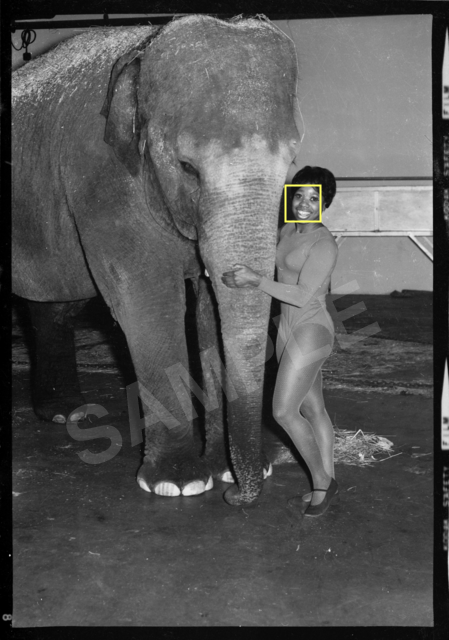

## Teenie Harris Dataset Documentation

#### This document provides information about, and links to, key data resources for the CMU+CMoA Teenie Harris Archive Analysis Project. 

Large (>1MB) data files linked herein are hosted at [Google Cloud Storage](https://console.cloud.google.com/storage/browser/teenieharris); some smaller files are also duplicated in this GitHUb repository. The majority of the resources described here are of two main types: 
* JSON, TSV and other text files that provide numeric and label descriptions of the content of photos (such as the coordinates of faces, identified object tags, etcetera).
* PNG image files and NPY (Numpy) binary archives of images, which contain pixelwise information about corresponding photographs (such as estimates of an image's depth, saliency, etc.).

<br />
*Woman in leotard posing with elephant, possibly for a circus* (Box 100, Image #15974) by Charles 'Teenie' Harris, c. 1950-1970 (© Carnegie Museum of Art, Charles “Teenie” Harris Archive, [2001.35.8192](https://collection.cmoa.org/objects/afb9ec17-bb48-440b-92d4-8f747ef0b83e)). 

Note that there is some redundancy of information between various files. For example: the dates that photographs were taken are stored in ```thp_year_metadata.json```, ```thp_meta_data.json```, and (in a different way) ```descriptions.tsv```; likewise, the number of faces detected in an image is stored (in various explicit or implicit ways) in files including ```thp_meta_data.json```, ```people_in_images_json.zip```, ```4-serv-face-boxes.tsv.zip```, and ```thp_face_rects.tsv.zip```.


---
### Table of Contents

* [Teenie Harris Files](#teenie-harris-files)
* [Image Descriptions](#image-descriptions)
* [Years as Floats](#years-as-floats)
* [Select Metadata Including Luminance](#select-metadata-including-luminance)
* [API Markup Layers](#api-markup-layers)
* [Imagga API](#imagga-api)
* [Google Cloud Vision API](#google-cloud-vision-api)
* [Microsoft Cognitive Services API](#microsoft-cognitive-services-api)
* [OpenPose](#openpose)
* [Detectron](#detectron)
* [OpenFace](#openface)
* [OpenFace+Microsoft](#openfacemicrosoft)
* [Analysis: People-in-Images](#analysis--people-in-images)
* [Face Ellipses](#face-ellipses)
* [Face Rects](#face-rects)
* [Face Nearest Neighbors](#face-nearest-neighbors)
* [Depth](#depth)
* [Colorized](#colorized)
* [Saliency](#saliency)
* [Saliency Maxima](#saliency-maxima)
* [DCNN](#dcnn)
* [Embeddings](#embeddings)
* [Assignments & Sortings](#assignments--sortings)
* [Thumbnails 64x64](#thumbnail-images-64x64)
* [Thumbnails 256x256](#thumbnail-images-256x256)
* [Thumbnails 256x256, Colorized](#thumbnail-images-256x256-colorized)
* [Thumbnails 512x512](#thumbnail-images-512x512)
* [Thumbnail Overviews](#thumbnail-overviews)
* [Credits and Acknowledgements](#credits)


---
### Teenie Harris Files

*Owing to permissions, high-resolution versions of the photographs in the Teenie Harris Archive are not available here. However, some 59,000 works in the Archive may be browsed at [collection.cmoa.org](https://collection.cmoa.org/?department=Fine%20Arts%3A%20Teenie%20Harris%20Archive&dir=desc&page=1&perPage=100).*

* ```canonical_filename_order.txt``` [[**1.1MB .TXT**](photos/canonical_filename_order.txt)]
  * 59,278 rows listing the "canonical order" we are using for the Teenie Harris image filenames.  
* ```canonical_image_dimensions_1600.tsv``` [[**1.58 MB .TSV**](https://storage.googleapis.com/teenieharris/photos/tsv/canonical_image_dimensions_1600.tsv)]
  * A tab-separated document containing dimensions of 59,278 Teenie Harris images, in canonical order, scaled so that their maximum dimension is 1600 pixels. 
  * The tab-separated header of this file is `boxname	filename	width	height`.
  * A local copy of this file is also [here](photos/canonical_image_dimensions_1600.tsv).
* ```photos_images_32x32.npy``` [[**57.89 MB .NPY**](https://storage.googleapis.com/teenieharris/photos/npy32/photos_images_32x32.npy)]
  * Extremely low-resolution (32x32 pixel) versions of the archive photos, encoded into a single Numpy binary file.
* ```filename_order.txt``` [[**1.01 MB .TXT**](https://storage.googleapis.com/teenieharris/analysis/filename_order.txt)]
* ```filename_order_box.txt``` [[**464 KB .TXT**](https://storage.googleapis.com/teenieharris/analysis/filename_order_box.txt)]
* ```filename_order_id.txt``` [[**341 KB .TXT**](https://storage.googleapis.com/teenieharris/analysis/filename_order_id.txt)]


---
### Image Descriptions

*Textual descriptions of the images in the Teenie Harris Archive, produced by the archive staff of the Carnegie Museum of Art.* 

* ```descriptions.tsv```  [[**14.2MB .TSV**](https://storage.googleapis.com/teenieharris/descriptions/descriptions.tsv)]
* ```descriptions.tsv.zip``` [[**4.3MB .ZIP**](descriptions/descriptions.tsv.zip)]

This is a headerless, tab-separated file which contains the following fields:

* imageName (not including image filetype extension, e.g. ".png") 
* textual description
* date (or date range)
* CMOA acquisition number
* imageOid UUID from the Microsoft database

Two example rows from this text file are provided here:

```
15236	Rev. Dr. Loran Mann and holding microphone attached to KDKA Radio 1020 tape recorder
	c. 1950-1970	2001.35.8126	24fd67e4-0de4-4214-890c-d56db73ad99b
15974	Woman in leotard posing with elephant, possibly for a circus
	c. 1950-1970	2001.35.8192	afb9ec17-bb48-440b-92d4-8f747ef0b83e
```

---
### Years as Floats

*This file contains an estimate of the data that a Teenie Harris image was taken, represented as a single floating-point number. This number is derived from the dates or date ranges prepared by the CMoA archival staff. In cases where precise month-dates are known, the number contains a decimal portion representing the fraction of the year represented by that date. Note: where ranges are given, this number represents the mid-point of that range; it should be noted that this therefore represents an "overly accurate" representation of the date.*

* ```thp_year_metadata.json``` [[**3.33 MB**]](meta/thp_year_metadata.json): Github (local) copy
* ```thp_year_metadata.json``` [[**3.33 MB**]](https://storage.googleapis.com/teenieharris/meta/thp_year_data.json): Duplicate data, stored at Google Cloud

```
{"YEAR": 1960.5, "FILE": "15236.png", "CANONICAL": 8141},
{"YEAR": 1960.5, "FILE": "15974.png", "CANONICAL": 8228}
```

---
### Select Metadata Including Luminance

*This file compiles select metadata about the Teenie Harris images, including information about the images' overall brightness (grayscale luminance); the number and age of detected faces; the year the image was taken; the image filename and canonical index. This file is used in the Teenie Harris interactive installation at CMoA.* 

* ```thp_meta_data.json.zip``` [[**3.39 MB .ZIP**]](https://storage.googleapis.com/teenieharris/meta/thp_meta_data.json.zip): *Duplicate data as below, stored at Google Cloud.*
* ```thp_meta_data.json.zip``` [[**3.39 MB .ZIP**]](meta/thp_meta_data.json.zip) Local (GitHub) copy of .ZIP-archived .JSON file containing select metadata for each image in the Teenie Harris Archive. Each entry (corresponding to one image) contains the following keys:
	* `FILE`: the image filename
	* `CANONICAL`: index (numbered from 0) in `canonical_filename_order.txt` 
	* `N_FACES`: number of faces detected in the scene
	* `AGE_AVG`: average age of all the detected faces
	* `AGE_MIN`: age of youngest face in the scene
	* `AGE_MAX`: age of oldest face in the scene
	* `AGE_MEDIAN`: median age of people in the scene
	* `AGE_BIGFACE`: age of the largest face in the scene
	* `PCAREA_FACES`: percentage of the image's total area covered by faces
	* `AREA_BIGFACE`: area of the largest face in the scene
	* `COLOR_MEDIAN`: median grayscale level (0...255) of entire image
	* `COLOR_AVG`: average grayscale level (0...255) of entire image
	* `COLOR_STDDEV`: standard deviation of grayscale levels in the entire image
	* `YEAR`: year the photo was taken; a float value based on the date. Duplicate of data stored in ```thp_year_metadata.json```.

The `N_FACES` field is calculated from a geometric union of data provided by Google, OpenPose, OpenFace and Microsoft. Facial age data in this file is from the [Microsoft Cognitive Services API](#microsoft-cognitive-services-api). Year data is derived from the Carnegie Museum of Art's Teenie Harris Archive team. Here are two example entries from ```thp_meta_data.json.zip```:

```
{"FILE":"15236.png", "CANONICAL": 8141, "N_FACES": 2, 
	"AGE_AVG": 33.9, "AGE_MIN": 33.9, "AGE_MAX": 33.9, 
	"AGE_MEDIAN": 33.9, "AGE_BIGFACE": 33.9, "PCAREA_FACES": 0.059673, 
	"AREA_BIGFACE": 54756, "COLOR_MEDIAN": 111.0, "COLOR_AVG": 110.144812, 
	"COLOR_STDDEV": 57.071441, "YEAR": 1960.5},
{"FILE": "15974.png", "CANONICAL": 8228, "N_FACES": 2, 
	"AGE_AVG": 17.2, "AGE_MIN": 17.2, "AGE_MAX": 17.2, 
	"AGE_MEDIAN": 17.2, "AGE_BIGFACE": 17.2, "PCAREA_FACES": 0.007130, 
	"AREA_BIGFACE": 6400, "COLOR_MEDIAN": 79.0, "COLOR_AVG": 83.324975, 
	"COLOR_STDDEV": 47.861416, "YEAR": 1960.5}
```


---
### API Markup Layers

*This image summarizes many of the markup layers calculated by various APIs and codebases, including body contours, face landmarks, and estimated skeletons.*

<br />
Markup layers in *Image #15236* by Charles 'Teenie' Harris

* BLACK  - skeletons from OpenPose
* GREEN  - face details from OpenPose
* BLUE   - people contours from Detectron
* RED    - face boxes from OpenFace
* PURPLE - face details from GoogleVision
* CYAN   - face details from Microsoft Cognitive services


---
### Imagga API

*Analysis of the Teenie Harris archive using the [Imagga](https://imagga.com/) image analysis service, including a wide range of semantic descriptors and confidence values.*

* ```imagga_analyses_of_teenie_harris_archive.zip``` [[**106MB ZIP**](https://storage.googleapis.com/teenieharris/imagga/json/imagga_analyses_of_teenie_harris_archive.zip)]
  * .ZIP archive containing 59,190 JSON files. Input images were 1600 pixels in their maximum dimension.
  * [Example JSON file](imagga/json/result_Box_100_15974.png.json) for Image #15974.

Some of the data produced by the Imagga service reveals questionable biases in the provided tags. For example, the JSON provided for Image #15974 begins: 

```
{
    "results": [
        {
            "tagging_id": null, 
            "image": "55b0872663a7df2cf4706e3f6702ffc4", 
            "tags": [
                {
                    "origin": "semantic", 
                    "confidence": 39.6674995422363, 
                    "tag": "elephant"
                }, 
                {
                    "origin": "additional", 
                    "confidence": 34.5266723632812, 
                    "tag": "sexy"
                }, 
 ```


---
### Google Cloud Vision API

*Results of analysis using the [Google Cloud Vision API](https://cloud.google.com/vision/overview/docs/) on the TeenieHarris 1600-pixel PNG images. Information includes face landmarks, object recognition, facial expression analysis, and optical character recognition (OCR).*

* ```google_analyses_of_teenie_harris_archive.zip``` [[**321.21MB .ZIP**](https://storage.googleapis.com/teenieharris/google/json/google_analyses_of_teenie_harris_archive.zip)]
  * ZIP archive containing 59,278 JSON files, each describing a corresponding Teenie Harris image. Input images were scaled to 1600 pixels in their maximum dimension. 
  * [Example JSON file](google/json/visionResult_Box100_15974.json) for image #15974.


---
### Microsoft Cognitive Services API

*Results of analyzing the Teenie Harris Archive with the [Microsoft Cognitive Services API](https://azure.microsoft.com/en-us/services/cognitive-services/), which provides information like face landmarks, gender estimation, age estimation, face expression ("emotion") estimation, etc. Some documentation about the Microsoft face analysis system can be found [here](https://godoc.org/github.com/ahmdrz/microsoft-cognitive-services/face) and [here](https://github.com/ahmdrz/microsoft-cognitive-services/blob/master/face/types.go#L50).*

* ```microsoft_json_faces.zip``` [[**114.26 MB**](https://storage.googleapis.com/teenieharris/microsoft/json/microsoft_json_faces.zip)]
  * 59,272 JSON files produced by Microsoft Cognitive Services.
  * [Example JSON file](microsoft/json/msft_15974.png.json) for image #15974.
* ```faces.bson.zip``` [[**79.64 MB .BSON**](https://storage.googleapis.com/teenieharris/microsoft/bson/faces.bson.zip)]
  * Single .BSON ("Binary JSON") file, a flat file created by MongoDB containing all of the Microsoft face data.
* ```faces.metadata.json``` [[**84 bytes**](https://storage.googleapis.com/teenieharris/microsoft/bson/faces.metadata.json)]
* ```imageOidAssociationTable.tsv.zip``` [[**427.79 KB**](https://storage.googleapis.com/teenieharris/microsoft/tsv/imageOidAssociationTable.tsv.zip)]
  * This is a zipped .TSV (tab-separated value) file which links the Archive's box and image filenames to the imageOid UUID from the Microsoft database. This file has a header row, and the top of the file looks like this: 
  
```
imageBox	imageName	imageOid
Box_001	686.png	583dfcfd1841423bb565ee29
```

---
### OpenPose

*Results from the CMU Perceptual Computing Lab's [OpenPose](https://github.com/CMU-Perceptual-Computing-Lab/openpose) (version 1.2) skeleton analysis, computed across the Teenie Harris archive. The data includes (2D) body skeletons, face landmarks, and hands.*

<br />*OpenPose skeleton data in Image #15974.*

* ```openpose_json.zip``` [[**368.97 MB .ZIP**](https://storage.googleapis.com/teenieharris/openpose/json/openpose_json.zip)]
  * 59,278 JSON files containing skeletons (etc.) corresponding to images in the Teenie Harris photo archive.
  * [Example JSON file](openpose/json/15974_keypoints.json) for image #15974.

The relevant fields in this JSON file are as follows: 
* `pose_keypoints_2d` array contains data for 18 points
* `face_keypoints_2d` array contains data for 70 points
* `hand_left_keypoints_2d` array contains data for 21 points
* `hand_right_keypoints_2d` array contains data for 21 points

Each of these arrays contains interleaved triplets of data, organized: [x, y, z, x, y, z, ...]. The accuracy or meaning of the 'z' values has not been tested or validated.


---
### Detectron

*Distillation of multi-category object detection using the [Facebook Detectron/COCO](https://github.com/facebookresearch/Detectron) object detector.*

<br />*Detectron contours in Image #15974.*

* ```detectron_categories.txt``` [[**1kb .TXT**](detectron/detectron_categories.txt)]
  * The ordered list of 80 Detectron/COCO categories, taken from [here](https://gist.github.com/AruniRC/7b3dadd004da04c80198557db5da4bda).
* ```teenie_detectron_json.zip``` [[**2.36GB ZIP**](https://storage.googleapis.com/teenieharris/detectron/json/teenie_detectron_json.zip)]
  * Zip archive containing 58,696 JSON files. Each JSON file containins contours of objects (and their category labels) calculated by the Facebook Detectron system. This includes non-person contours. Contour vertex coordinates are scaled to input images whose maximum dimension was 1600 pixels. 
  * [Example JSON file](detectron/json/15974.json) for image #15974.
* ```detectron_rendered_contours_1600px.zip``` [[**583.77MB .ZIP**](https://storage.googleapis.com/teenieharris/detectron/png1600/detectron_rendered_contours_1600px.zip)]
  * Zip archive containing 58,696 .PNG files, each of which displays (in white pixels on a black background) the contours of people (exclusively) in the correspondingly-named Teenie Harris image. *Only contours of people are shown.* All images are scaled to 1600 pixels in their maximum dimension.
  * [Example PNG file](detectron/png1600/15974.png) for image #15974.
* ```images.npy``` [[**57.89MB Numpy file**](https://storage.googleapis.com/teenieharris/detectron/npy32/images.npy)]
  * Numpy binary file containing containing 59,278 .PNG files, which are 32x32 pixel versions of the rendered contour images (produced through a scaled-down centered inner crop). 
* ```canonical_detectron_category_scores_59278rows.tsv``` [[**1.24MB ZIP**](https://storage.googleapis.com/teenieharris/detectron/tsv/canonical_detectron_category_scores_59278rows.tsv.zip)]
  * This file reports, for every Teenie Harris image, the confidence scores (0...1) that each of the Detectron categories appears in that image.
  * In cases where an image contains more than one detected object with that class category, this file reports the *maximum* confidence score encountered in that image. 
  * The rows of this file are in "canonical order", meaning, the sorted according to the *canonical list of files*. This canonical list (generated via 'natural sorting' can be found [here](processing_code/DetectronCategorizerReorder/data/canonical_filename_order.txt).
  * Zero'ed rows for the 'missing' (null-detectron-data) 582 images have been appropriately inserted, so that the number of rows is 59,278. 
  * Image filenames are *not* included in this file. 
  * This is a zipped file of tab-separated values (TSV). 
* ```canonical_detectron_category_counts_59278rows.tsv``` [[**439kb .ZIP**](https://storage.googleapis.com/teenieharris/detectron/tsv/canonical_detectron_category_counts_59278rows.tsv.zip)]
  * Same as the above, but this file reports, for every image, a row containing the *count of instances* for each Detectron category.
* ```detectron_category_scores_boxorder_58696rows.tsv``` [[**1.39MB .ZIP**](https://storage.googleapis.com/teenieharris/detectron/tsv/detectron_category_scores_boxorder_58696rows.tsv.zip)]
  * This file reports, for every Teenie Harris image, the confidence scores (0...1) that each of the Detectron categories appears in that image.
  * In cases where an image contains more than one detected object with that class category, this file reports the *maximum* confidence score encountered in that image.  
  * The first column is the file name of the image, e.g. "Box_001/686.json". 
  * The rows of this file are in "box order", meaning, the order produced by Java/Processing when recursively traversing the Teenie Harris image collection.  
  * This file only contains 58,696 rows. 582 images do not have any Detectron results nor any corresponding files.
  * This is a zipped file of tab-separated values (TSV).
* ```detectron_category_counts_boxorder_58696rows.tsv``` [[**595kb .ZIP**](https://storage.googleapis.com/teenieharris/detectron/tsv/detectron_category_counts_boxorder_58696rows.tsv.zip)]
  * Same as the above, but this file reports the *count of instances* for each category. An image with 3 cars will have the integer '3' in the column corresponding to automobiles.


---
### OpenFace

*[OpenFace](https://cmusatyalab.github.io/openface/) is a Python and Torch implementation of face recognition with deep neural networks. Faces are described with a bounding box, and a 128-dimensional vector of face-specific floating-point numbers. The 128 numbers are stored in the `rep` field of the JSON files.*


* ```openface_json.zip``` [[**278.03 MB .ZIP**](https://storage.googleapis.com/teenieharris/openface/json/openface_json.zip)]
  * 59,278 JSON files containing data about the faces that appear in each Teenie Harris image.
  * [Example JSON file](openface/json/15974.png.json) for image #15974.

*The OpenFace materials below were produced by the notebook, "Create Cropped Faces.ipynb":*

* ```filenames.csv.zip``` [[**250kb .ZIP**](https://storage.googleapis.com/teenieharris/openface/npy32/filenames.csv.zip)] - the filename the face was taken from
* ```descriptors.npy``` [[**240MB .ZIP**](https://storage.googleapis.com/teenieharris/openface/npy32/descriptors.npy)] - the OpenFace descriptor for the face
* ```images.npy``` [[**240MB .ZIP**](https://storage.googleapis.com/teenieharris/openface/npy32/images.npy)] - the cropped images
* ```indices.npy``` [[**1.8MB .ZIP**](https://storage.googleapis.com/teenieharris/openface/npy32/indices.npy)] - the index of a face within the photo


---
### OpenFace+Microsoft

*JSON files which merge the 128-dimensional abstract face descriptors produced by [OpenFace](https://cmusatyalab.github.io/openface/), with the gender and age information computed by Microsoft Cognitive Services API. Useful for supervised UMAP/t-SNE analysis of the faces in the archive.*


* ```openface_microsoft_json_faces.zip``` [[**267.57 MB**](https://storage.googleapis.com/teenieharris/openface_microsoft/json/openface_microsoft_json_faces.zip)]
  * 59,278 JSON files, representing (for each Teenie Harris image) the faces in that image, the bounding rectangle of those faces, the 128-dimensonal openFace feature vector describing each face (`rep`), and additional information (computed by Microsoft) describing the gender and age of that face.
  * [Example JSON file](openface_microsoft/json/15974.json) for image #15974.
  * Face bounding rect coordinates in these files are relative to an 800x800 image bound.
  * Note that this bundle only includes data for faces that are detected by *both* Microsoft (which provides estimates of age and gender) and OpenFace (which provides 128-dimensional face descriptors). This bundle does *not* contain information for faces that are not detected by both of these services.
  * In these JSON files, face gender and age data is encoded in a "one-hot" field entitled `genderAndAgeOneHotData`, as follows:

> * Field #0: Is this data valid? 1 if Yes.
> * Fields #1 and #2: Gender: 00 (none), 01 (male), 10 (female).
> * Fields #3-22: Age, in 5-year bins.


---
### Analysis / People-in-Images


* ```people_in_images_json.zip``` [[**2.9 GB .ZIP**](https://storage.googleapis.com/teenieharris/analysis/people_in_images/json/people_in_images_json.zip)]
  * 59,278 JSON files (one for each Teenie Harris image] containing arrays of *people*, where each person is a concordance of spatially-aligned data from Google, Microsoft, OpenPose, and OpenFace. The data includes face landmarks, body contours, and face description data, among other fields. In other words, face bounding boxes from all four services have been checked against each other and aligned, and grouped by person. Note that not every person object contains data from all four services. (For example, sometimes a face is detected by one service, but not by another.)
  * [Example JSON file](analysis/people_in_images/json/people_in_images_15974.json) for image #15974.


---
### Face Ellipses

*Images containing (white) oriented ellipses (on a black background) that indicate the locations of faces. The face locations are taken from a mixture of Google, OpenPose, OpenFace and Microsoft (whichever has data). The face orientation angles are taken from Google API or Microsoft API, whichever has data.*

<br />*Face ellipse for Image #15974.*

* ```face_ellipses_png640.zip``` [[**86.15MB .ZIP**](https://storage.googleapis.com/teenieharris/face_ellipses/png640/face_ellipses_png640.zip)]
  * 59,278 .PNG files, whose maximum dimension is 640 pixels.
  * [Example PNG image](face_ellipses/png640/15974.png) for image #15974.
* ```face_ellipses_images_32x32.npy``` [[**57.89 MB .ZIP**](https://storage.googleapis.com/teenieharris/face_ellipses/npy32/face_ellipses_images_32x32.npy)]
  * Numpy binary file containing 32x32 pixel versions of the openface ellipse images.  

---
### Face Rects

*Numeric data storing rectangles that indicate the locations of faces in the Teenie Harris images. The face rectangles are derived from the union of Google, OpenPose, OpenFace and Microsoft (whichever has data). Where different APIs have produced small differences in detected rectangles, the rectangles stored here are an average of their results.*

<br />*Face rect(s) for Image #15974.*

* ```thp_face_rects.tsv.zip``` [[**1.44 MB .ZIP**]](face_rects/thp_face_rects.tsv.zip): Zipped, tab-separated file indicating the locations of face rectangles for each of the Teenie Harris images. Each image's data appears on a single row, in canonical order. The rectangles are stored as floats, representing percentages of each image's width (for X and W) and the image's height (for Y and H), in the format: ```X\tY\tW\tH\tX\tY\tW\tH...```
* ```thp_face_rects.tsv.zip``` [[**1.44 MB .ZIP**]](https://storage.googleapis.com/teenieharris/face_rects/thp_face_rects.tsv.zip): Duplicate of above, stored in Google Cloud

For example, from [```canonical_filename_order.txt```](photos/canonical_filename_order.txt) we know that Image #15974 ("Woman in leotard posing with elephant") occupies row #8228 (counting from 0, not 1) in the Canonical Filename Order. The corresponding row 8228 in ```thp_face_rects.tsv``` contains 4 tab-separated numbers as follows, indicating that one face rectangle has been stored. These rectangles can be displayed using [this small Processing test program](face_rects/face_rects.pde).

```
0.635	0.29	0.079	0.056
```


---
### Face Nearest Neighbors

*With the help of OpenFace/dLib, many faces not only have landmark data (eye locations, etc.) but many (but not all) also have 128-dimensional feature vectors that describe them in abstract 'face space'. The files in this section provide information about faces whose vectors match up well. Note that there is no guarantee that two faces with closely-matching feature vectors actually represent the same person.*


* ```face_neighbors.json``` [[**939 KB .JSON**]](face_nearest_neighbors/face-neighbors.json) Local copy of below.
* ```face-neighbors.json``` [[**939 KB .JSON**]](https://storage.googleapis.com/teenieharris/analysis/face_neighbors/face-neighbors.json): The 3,451 closest-matching faces (i.e. with mutual distances under 0.3).


#### Face Rects

* ```4-serv-face-boxes.tsv.zip``` [[**2.62 MB .ZIP**]](https://storage.googleapis.com/teenieharris/face_nearest_neighbors/4-serv-face-boxes.tsv.zip): The face rectangles in each image. Each line is of the format `X\tY\tW\tH\tX\tY\tW\tH\t…`, representing the face bounding boxes in one image. Each line corresponds to an image, canonical file order. The data in this file appears to be nearly identical to the rectangles in [```thp_face_rects.tsv.zip```](face_rects/thp_face_rects.tsv.zip) (see above), except that there is slightly higher precision. 
* ```4-serv-face-boxes.tsv.zip``` [[**2.62 MB .ZIP**]](face_nearest_neighbors/4-serv-face-boxes.tsv.zip): Local (Github) copy of above.

#### Face Nearest Neighbors (Comprehensive)

*The Teenie Harris Archive of ~60,000 images contains approximately ~250,000 faces. Many people are represented several times. The files here list, for every face in the archive, the closest-matching faces from other images.* 

* ```face-nn7.tsv.zip``` [[**15.31 MB .ZIP**]](face_nearest_neighbors/face-nn7.tsv.zip): Local (Github) copy of below.
* ```face-nn7.tsv.zip``` [[**15.31 MB .ZIP**]](https://storage.googleapis.com/teenieharris/face_nearest_neighbors/face-nn7.tsv.zip): This zipped, tab-separated file contains information about the nearest neighbors of faces. Each line corresponds to a Teenie Harris image in canonical filename order, and contains the following information, separated with tabs:
	* For the 1st face in the current image: the 6 best-matching faces from other images
	* For the 2nd face in the current image: the 6 best-matching faces from other images
	* For the 3rd face in the current image: the 6 best-matching faces from other images
	* Etcetera.
* For a given face in the current image, best-matching faces from other images are stored in the following format: 
  * Canonical ID of another image which contains a face that matches the 1st face in the current image.
  * The bounding box of the 1st face in the current image, represented as a comma-separated quartet (x,y,w,h).
  * The bounding box of the face that matches the 1st face in the current image, which is in the other image, represented as a comma-separated quartet (x,y,w,h).
  * The similarity between the 1st face in this image, and that face in the other image, represented as a number in the range (0...1). 
  * Etcetera.

For example, Image 493.png (from box Box_087), with canonical order #12, has 5 known faces. The row for this image in the file ```face-nn7.tsv.zip```, reformatted here for legibility, looks like the below. Each of these 5 detected faces has associated data describing the 6 faces from other images that best match it:

```
17730	162,256,64,64	351,226,31,31	0.09755
7122	162,256,64,64	281,251,31,31	0.12007
38746	162,256,64,64	260,153,54,53	0.13215
48225	162,256,64,64	330,81,37,37	0.13340
17881	162,256,64,64	251,185,37,37	0.13650
54989	162,256,64,64	85,282,21,21	0.13678

40016	499,129,54,54	250,258,21,21	0.20457
54343	499,129,54,54	487,293,37,37	0.21016
34173	499,129,54,54	302,233,31,31	0.21774
51171	499,129,54,54	358,220,26,26	0.23670
40015	499,129,54,54	252,245,18,18	0.24313
41782	499,129,54,54	171,213,54,54	0.26389

25419	571,84,64,64	306,170,111,111	0.21020
54132	571,84,64,64	265,181,21,22	0.21582
41643	571,84,64,64	589,185,31,31	0.23174
31528	571,84,64,64	615,212,45,44	0.23647
14576	571,84,64,64	375,177,37,37	0.24265
16886	571,84,64,64	265,231,21,21	0.24290

56221	237,189,53,54	222,177,37,37	0.22786
17323	237,189,53,54	529,276,37,37	0.23899
54333	237,189,53,54	234,255,37,37	0.27633
39319	237,189,53,54	308,243,53,53	0.27791
29995	237,189,53,54	67,151,26,26	0.27949
54967	237,189,53,54	333,154,31,31	0.29040

46329	398,189,53,54	627,202,31,31	0.32061
23672	398,189,53,54	195,224,21,21	0.32249
36603	398,189,53,54	355,201,37,37	0.32692
24302	398,189,53,54	177,269,26,26	0.33274
18172	398,189,53,54	526,311,21,21	0.34124
29341	398,189,53,54	583,272,37,37	0.34935
```

---
### Depth

*An archive of .PNG images representing the estimated "depth" of the scene in every Teenie Harris image, as estimated by [FCRN Depth Prediction](https://github.com/iro-cp/FCRN-DepthPrediction) ("Deeper Depth Prediction with Fully Convolutional Residual Networks"). A similar algorithm (DenseDepth by Ibraheem Alhashim) is also accessibly [provided by RunwayML](https://runwayml.com/).*

<br />*Estimated depth map for Image #15974.*

* ```depth_png320.zip``` [[**1.35 GB .ZIP**](https://storage.googleapis.com/teenieharris/depth/png320/depth_png320.zip)]
  * 59,278 .PNG files, whose maximum dimension is 320 pixels. Lighter colors indicate pixels that are estimated to be "further away" from the camera.
  * [Example PNG image](depth/png320/15974.png) for image #15974.
* ```depth_images_32x32.npy``` [[**57.89 MB .NPY**](https://storage.googleapis.com/teenieharris/depth/npy32/depth_images_32x32.npy)]
  * Numpy binary file containing 32x32 pixel versions of the depth images.

  
---
### Colorized

*Fifteen archives, each containing 50 sub-archives, containing artificially "colorized" versions of the (ordinarily black-and-white) Teenie Harris Archive images. These have been automatically colorized using Jason Antic's deep-learning-based [DeOldify](https://github.com/jantic/DeOldify) algorithm. (DeOldify is also accessibly [provided by RunwayML](https://runwayml.com/)). Images are stored as JPEGs with a maximum dimension of 640 pixels.*

<br />*Artificially colorized version of Image #15974, from Box #100.* 

1.  [Boxes 001-050](https://storage.googleapis.com/teenieharris/colorized/CLR_001_050.zip) (1.81 GB .ZIP)
2.  [Boxes 051-100](https://storage.googleapis.com/teenieharris/colorized/CLR_051_100.zip) (1.78 GB .ZIP)
3.  [Boxes 101-150](https://storage.googleapis.com/teenieharris/colorized/CLR_101_150.zip) (1.77 GB .ZIP)
4.  [Boxes 151-200](https://storage.googleapis.com/teenieharris/colorized/CLR_151_200.zip) (1.71 GB .ZIP)
5.  [Boxes 201-250](https://storage.googleapis.com/teenieharris/colorized/CLR_201_250.zip) (1.74 GB .ZIP)
6.  [Boxes 251-300](https://storage.googleapis.com/teenieharris/colorized/CLR_251_300.zip) (1.70 GB .ZIP)
7.  [Boxes 301-350](https://storage.googleapis.com/teenieharris/colorized/CLR_301_350.zip) (1.68 GB .ZIP)
8.  [Boxes 351-400](https://storage.googleapis.com/teenieharris/colorized/CLR_351_400.zip) (1.74 GB .ZIP)
9.  [Boxes 401-450](https://storage.googleapis.com/teenieharris/colorized/CLR_401_450.zip) (1.72 GB .ZIP)
10. [Boxes 451-500](https://storage.googleapis.com/teenieharris/colorized/CLR_451_500.zip) (1.74 GB .ZIP)
11. [Boxes 501-550](https://storage.googleapis.com/teenieharris/colorized/CLR_501_550.zip) (1.75 GB .ZIP)
12. [Boxes 551-600](https://storage.googleapis.com/teenieharris/colorized/CLR_551_600.zip) (1.70 GB .ZIP)
13. [Boxes 601-650](https://storage.googleapis.com/teenieharris/colorized/CLR_601_650.zip) (1.69 GB .ZIP)
14. [Boxes 651-700](https://storage.googleapis.com/teenieharris/colorized/CLR_651_700.zip) (2.07 GB .ZIP)
15. [Boxes 701-750](https://storage.googleapis.com/teenieharris/colorized/CLR_701_750.zip) (0.82 GB .ZIP)

*These colorized versions of the Harris images are useful for bootstrapping some forms of further machine analysis, by providing coarse estimates of color information where none otherwise exists. The DeOldify algorithm which generated these images makes the sky blue, grass green, and human skin more-or-less pinkish-brown (effectively taking the channelwise mean of the data, and adapting it to better match the "correct" (or expected) input distribution across channels). While this can lead to dramatic improvements in subsequent image analysis, the colorized images themselves should not be displayed publicly — both because of their divergenge from Harris's artistic intention, and because of the fraught social and ethical issues involved in "colorizing" the subjects of his photographs.*

---
### Saliency

*A collection of .PNG images that represent the estimated pixelwise "saliency" in every Teenie Harris image, as estimated by [SalGAN](https://github.com/imatge-upc/saliency-salgan-2017) ("SalGAN: Visual Saliency Prediction with Generative Adversarial Networks"). To generalize broadly, "saliency" appears to encode things like faces and text.*

<br />*Estimated saliency map for Image #15974.*
  	
* ```saliency_jpg640.zip``` [[**828.75 MB .ZIP**](https://storage.googleapis.com/teenieharris/saliency/jpg640/saliency_jpg640.zip)]
  * 59,278 .JPG grayscale images, whose pixels represent an estimate of the "saliency" in that image. Images are 640 pixels in their maximum dimension.
  * [Example JPG image](saliency/jpg640/15974.jpg) for image #15974.
* ```saliency_images_32x32.npy``` [[**57.89 MB .NPY**](https://storage.googleapis.com/teenieharris/saliency/npy32/saliency_images_32x32.npy)]
  * Numpy binary file containing 32x32 pixel versions of the saliency images. 

---
### Saliency Maxima

<br />*Local maxima of saliencies in Image #15974.*

These files contains the locations of the *local maxima points* of the saliency images, calculated using [Non-Maximum Suppression](https://towardsdatascience.com/non-maximum-suppression-nms-93ce178e177c). Saliency maxima are useful for knowing where points of likely visual interest are in an image, especially in cases where faces and text go undetected. 

* ```saliency_nms.tsv``` [[**5.5 MB .TSV**]](saliency/saliency_nms.tsv): This tab-separated file contains the *local maxima points* of the saliency images. In this file, the local maxima for a given image are stored together in a single row of text, as sequences of triplets (X,Y,R), in the format ```X\tY\tR\tX\tY\tR...```. Here, X represents a fraction (0...1) of the image's width; Y represents a fraction (0...1) of the image's height; and R is an integer representing the strength of that local maximum. The rows represent the images in Canonical Filename Order.
* ```saliency_nms.json.zip``` [[**1.8 MB .ZIP**]](saliency/saliency_nms.json): Same data as above, in JSON format, in a compressed .ZIP archive. 
* ```saliency_nms_32x32.npy.zip``` [[**1.3 MB .ZIP**]](saliency/saliency_nms_32x32.npy.zip): Zipped nx32x32 numpy file storing the results of Non-Maximum Suppression calculations on the 32x32 (cropped) pixel versions of the saliency images.

For example, from [```canonical_filename_order.txt```](photos/canonical_filename_order.txt) we know that Image #15974 ("*Woman in leotard posing with elephant*") occupies row #8228 (counting from 0, not 1) in the Canonical Filename Order. The corresponding row 8228 in ```saliency_nms.tsv``` contains 18 tab-separated numbers as follows, indicating that 6 "saliency maxima" have been detected. These saliencies can be displayed using [this small Processing test program](saliency/saliency.pde).
	
```
0.015	0.160	1	 0.296	0.225	41	0.452	0.291	46	 0.702	0.335	135	 0.202	0.554	16	0.702	0.686	24
```
The corresponding line in ```saliency_nms.json.zip``` (unzipped) appears as: 
```
[{"x":0.015,"y":0.16,"val":1},{"x":0.296,"y":0.225,"val":41},{"x":0.452,"y":0.291,"val":46},{"x":0.702,"y":0.335,"val":135},{"x":0.202,"y":0.554,"val":16},{"x":0.702,"y":0.686,"val":24}],
```

  
---
### DCNN

*Features of the Teenie Harris Images, computed using a pair of discrete convolutional neural networks (Inceptionv3 and VGG16). Inception v3 is a widely-used image recognition model that has been shown to attain greater than 78.1% accuracy on the ImageNet dataset. VGG16 is a convolutional neural network model that achieves 92.7% top-5 test accuracy in ImageNet.*

*The Inception v3 analysis was performed with Kyle McDonald's notebook, ["Image Classification and Similarity"](https://github.com/kylemcdonald/ml-examples/blob/master/workshop/image_similarity/Image%20Classification%20and%20Similarity.ipynb). The VGG16 analysis was performed using Gene Kogan's OpenFrameworks project, ["Example-Encode"](https://github.com/kylemcdonald/ofxCcv/tree/master/example-encode).*

*Note: These features were calculated on the monochrome (grayscale) versions of the Teenie Harris Archive.* 

* ```features_inceptionv3_canonical.npy``` [[**926.22 MB .NPY**](https://storage.googleapis.com/teenieharris/dcnn/inceptionv3/features_inceptionv3_canonical.npy)]
* ```predictions_inceptionv3_canonical.npy``` [[**455.87 MB .NPY**](https://storage.googleapis.com/teenieharris/dcnn/inceptionv3/predictions_inceptionv3_canonical.npy)]
* ```features_inceptionv3.csv.zip``` [[**422.83 MB .ZIP**](https://storage.googleapis.com/teenieharris/dcnn/inceptionv3/features_inceptionv3.csv.zip)]
* ```predictions_inceptionv3.csv.zip``` [[**233.02 MB .ZIP**](https://storage.googleapis.com/teenieharris/dcnn/inceptionv3/predictions_inceptionv3.csv.zip)]
* ```filenames_inceptionv3.txt.zip``` [[**131.7 KB .ZIP**](https://storage.googleapis.com/teenieharris/dcnn/inceptionv3/filenames_inceptionv3.txt.zip)]

And 

* ```features_vgg_canonical.npy``` [[**1.81 GB .NPY**](https://storage.googleapis.com/teenieharris/dcnn/vgg/features_vgg_canonical.npy)]
* ```features_vgg.csv.zip``` [[**246.31 MB .ZIP**](https://storage.googleapis.com/teenieharris/dcnn/vgg/features_vgg.csv.zip)]
* ```filenames_vgg.txt.zip``` [[**131.7 KB .ZIP**](https://storage.googleapis.com/teenieharris/dcnn/vgg/filenames_vgg.txt.zip)]


---
### Embeddings

*2D embeddings (dimensionally-reduced arrangements) of the Teenie Harris Archive, computed by UMAP using different analysands.*

* ```embeddings_depth.zip``` [[**4.4 MB .ZIP**](https://storage.googleapis.com/teenieharris/embeddings/embeddings_depth.zip)]
* ```embeddings_detectron.zip``` [[**4.33 MB .ZIP**](https://storage.googleapis.com/teenieharris/embeddings/embeddings_detectron.zip)]
* ```embeddings_detectron_supervised.zip``` [[**4.26 MB .ZIP**](https://storage.googleapis.com/teenieharris/embeddings/embeddings_detectron_supervised.zip)]
* ```embeddings_face_ellipses.zip	``` [[**4.26 MB .ZIP**](https://storage.googleapis.com/teenieharris/embeddings/embeddings_face_ellipses.zip)]
* ```embeddings_inceptionv3_features.zip``` [[**4.31 MB .ZIP**](https://storage.googleapis.com/teenieharris/embeddings/embeddings_inceptionv3_features.zip)]
* ```embeddings_inceptionv3_features_supervised.zip``` [[**4.27 MB .ZIP**](https://storage.googleapis.com/teenieharris/embeddings/embeddings_inceptionv3_features_supervised.zip)]
* ```embeddings_inceptionv3_predictions.zip``` [[**4.19 MB .ZIP**](https://storage.googleapis.com/teenieharris/embeddings/embeddings_inceptionv3_predictions.zip)]
* ```embeddings_inceptionv3_predictions_supervised.zip``` [[**4.18 MB .ZIP**](https://storage.googleapis.com/teenieharris/embeddings/embeddings_inceptionv3_predictions_supervised.zip)]
* ```embeddings_openface.zip``` [[**17.91 MB .ZIP**](https://storage.googleapis.com/teenieharris/embeddings/embeddings_openface.zip)]
* ```embeddings_openface_microsoft.zip``` [[**14.45 MB .ZIP**](https://storage.googleapis.com/teenieharris/embeddings/embeddings_openface_microsoft.zip)]
* ```embeddings_saliency.zip``` [[**4.55 MB .ZIP**](https://storage.googleapis.com/teenieharris/embeddings/embeddings_saliency.zip)]
* ```embeddings_vgg_features.zip``` [[**5.01 MB .ZIP**](https://storage.googleapis.com/teenieharris/embeddings/embeddings_vgg_features.zip)]
* ```embeddings_vgg_features_supervised.zip``` [[**4.53 MB .ZIP**](https://storage.googleapis.com/teenieharris/embeddings/embeddings_vgg_features_supervised.zip)]

Below are variations of 2D embeddings derived from the application of the InceptionV3 neural network to the *colorized* versions of the Teenie Harris images, provided in both Numpy and TSV formats. Embeddings labeled 'predictions' are derived from the vector of the network's category predictions (dog, car, house, etc.), while those labeled 'features' are vectors derived from the second-to-last layer of the network, and represent the strengths of generic feature components (eye, wheel, window, etc.). Note that the *colorized* versions of the Harris images have been used to improve and bootstrap the results of InceptionV3, by providing coarse estimates of color information where none otherwise exists. 

* ```embedding_inception_features_0.001_02.npy``` [[**474 KB**]](https://storage.googleapis.com/teenieharris/embeddings/inception_from_colorized/embedding_inception_features_0.001_02.npy)
* ```embedding_inception_features_0.001_03.npy``` [[**474 KB**]](https://storage.googleapis.com/teenieharris/embeddings/inception_from_colorized/embedding_inception_features_0.001_03.npy)
* ```embedding_inception_features_0.001_05.npy``` [[**474 KB**]](https://storage.googleapis.com/teenieharris/embeddings/inception_from_colorized/embedding_inception_features_0.001_05.npy)
* ```embedding_inception_features_0.010_02.npy``` [[**474 KB**]](https://storage.googleapis.com/teenieharris/embeddings/inception_from_colorized/embedding_inception_features_0.010_02.npy)
* ```embedding_inception_features_0.010_03.npy``` [[**474 KB**]](https://storage.googleapis.com/teenieharris/embeddings/inception_from_colorized/embedding_inception_features_0.010_03.npy)
* ```embedding_inception_features_0.010_05.npy``` [[**474 KB**]](https://storage.googleapis.com/teenieharris/embeddings/inception_from_colorized/embedding_inception_features_0.010_05.npy)
* ```embedding_inception_features_0.100_02.npy``` [[**474 KB**]](https://storage.googleapis.com/teenieharris/embeddings/inception_from_colorized/embedding_inception_features_0.100_02.npy)
* ```embedding_inception_features_0.100_03.npy``` [[**474 KB**]](https://storage.googleapis.com/teenieharris/embeddings/inception_from_colorized/embedding_inception_features_0.100_03.npy)
* ```embedding_inception_features_0.100_05.npy``` [[**474 KB**]](https://storage.googleapis.com/teenieharris/embeddings/inception_from_colorized/embedding_inception_features_0.100_05.npy)
* ```embedding_inception_predictions_0.001_02.npy``` [[**474 KB**]](https://storage.googleapis.com/teenieharris/embeddings/inception_from_colorized/embedding_inception_predictions_0.001_02.npy)
* ```embedding_inception_predictions_0.001_03.npy``` [[**474 KB**]](https://storage.googleapis.com/teenieharris/embeddings/inception_from_colorized/embedding_inception_predictions_0.001_03.npy)
* ```embedding_inception_predictions_0.001_05.npy``` [[**474 KB**]](https://storage.googleapis.com/teenieharris/embeddings/inception_from_colorized/embedding_inception_predictions_0.001_05.npy)
* ```embedding_inception_predictions_0.010_02.npy``` [[**474 KB**]](https://storage.googleapis.com/teenieharris/embeddings/inception_from_colorized/embedding_inception_predictions_0.010_02.npy)
* ```embedding_inception_predictions_0.010_03.npy``` [[**474 KB**]](https://storage.googleapis.com/teenieharris/embeddings/inception_from_colorized/embedding_inception_predictions_0.010_03.npy)
* ```embedding_inception_predictions_0.010_05.npy``` [[**474 KB**]](https://storage.googleapis.com/teenieharris/embeddings/inception_from_colorized/embedding_inception_predictions_0.010_05.npy)
* ```embedding_inception_predictions_0.100_02.npy``` [[**474 KB**]](https://storage.googleapis.com/teenieharris/embeddings/inception_from_colorized/embedding_inception_predictions_0.100_02.npy)
* ```embedding_inception_predictions_0.100_03.npy``` [[**474 KB**]](https://storage.googleapis.com/teenieharris/embeddings/inception_from_colorized/embedding_inception_predictions_0.100_03.npy)
* ```embedding_inception_predictions_0.100_05.npy``` [[**474 KB**]](https://storage.googleapis.com/teenieharris/embeddings/inception_from_colorized/embedding_inception_predictions_0.100_05.npy)
* ```embedding_inception_features_0.001_02.tsv``` [[**2.2 MB**]](https://storage.googleapis.com/teenieharris/embeddings/inception_from_colorized/embedding_inception_features_0.001_02.tsv)
* ```embedding_inception_features_0.001_03.tsv``` [[**2.2 MB**]](https://storage.googleapis.com/teenieharris/embeddings/inception_from_colorized/embedding_inception_features_0.001_03.tsv)
* ```embedding_inception_features_0.001_05.tsv``` [[**2.2 MB**]](https://storage.googleapis.com/teenieharris/embeddings/inception_from_colorized/embedding_inception_features_0.001_05.tsv)
* ```embedding_inception_features_0.010_02.tsv``` [[**2.2 MB**]](https://storage.googleapis.com/teenieharris/embeddings/inception_from_colorized/embedding_inception_features_0.010_02.tsv)
* ```embedding_inception_features_0.010_03.tsv``` [[**2.2 MB**]](https://storage.googleapis.com/teenieharris/embeddings/inception_from_colorized/embedding_inception_features_0.010_03.tsv)
* ```embedding_inception_features_0.010_05.tsv``` [[**2.2 MB**]](https://storage.googleapis.com/teenieharris/embeddings/inception_from_colorized/embedding_inception_features_0.010_05.tsv)
* ```embedding_inception_features_0.100_02.tsv``` [[**2.2 MB**]](https://storage.googleapis.com/teenieharris/embeddings/inception_from_colorized/embedding_inception_features_0.100_02.tsv)
* ```embedding_inception_features_0.100_03.tsv``` [[**2.2 MB**]](https://storage.googleapis.com/teenieharris/embeddings/inception_from_colorized/embedding_inception_features_0.100_03.tsv)
* ```embedding_inception_features_0.100_05.tsv``` [[**2.2 MB**]](https://storage.googleapis.com/teenieharris/embeddings/inception_from_colorized/embedding_inception_features_0.100_05.tsv)
* ```embedding_inception_predictions_0.001_02.tsv``` [[**2.2 MB**]](https://storage.googleapis.com/teenieharris/embeddings/inception_from_colorized/embedding_inception_predictions_0.001_02.tsv)
* ```embedding_inception_predictions_0.001_03.tsv``` [[**2.2 MB**]](https://storage.googleapis.com/teenieharris/embeddings/inception_from_colorized/embedding_inception_predictions_0.001_03.tsv)
* ```embedding_inception_predictions_0.001_05.tsv``` [[**2.2 MB**]](https://storage.googleapis.com/teenieharris/embeddings/inception_from_colorized/embedding_inception_predictions_0.001_05.tsv)
* ```embedding_inception_predictions_0.010_02.tsv``` [[**2.2 MB**]](https://storage.googleapis.com/teenieharris/embeddings/inception_from_colorized/embedding_inception_predictions_0.010_02.tsv)
* ```embedding_inception_predictions_0.010_03.tsv``` [[**2.2 MB**]](https://storage.googleapis.com/teenieharris/embeddings/inception_from_colorized/embedding_inception_predictions_0.010_03.tsv)
* ```embedding_inception_predictions_0.010_05.tsv``` [[**2.2 MB**]](https://storage.googleapis.com/teenieharris/embeddings/inception_from_colorized/embedding_inception_predictions_0.010_05.tsv)
* ```embedding_inception_predictions_0.100_02.tsv``` [[**2.2 MB**]](https://storage.googleapis.com/teenieharris/embeddings/inception_from_colorized/embedding_inception_predictions_0.100_02.tsv)
* ```embedding_inception_predictions_0.100_03.tsv``` [[**2.2 MB**]](https://storage.googleapis.com/teenieharris/embeddings/inception_from_colorized/embedding_inception_predictions_0.100_03.tsv)
* ```embedding_inception_predictions_0.100_05.tsv``` [[**2.2 MB**]](https://storage.googleapis.com/teenieharris/embeddings/inception_from_colorized/embedding_inception_predictions_0.100_05.tsv)

Additional embeddings: 

* ```combined_features_m2_0.001_10.tsv```     [[**2.11 MB**]](https://storage.googleapis.com/teenieharris/embeddings/combined_features_m2_0.001_10.tsv)
* ```combined_features_m4_0.001_10.tsv```     [[**2.11 MB**]](https://storage.googleapis.com/teenieharris/embeddings/combined_features_m4_0.001_10.tsv)
* ```combined_features_m16_0.001_10.tsv```    [[**2.11 MB**]](https://storage.googleapis.com/teenieharris/embeddings/combined_features_m16_0.001_10.tsv)
* ```combined_features_m32_0.001_10.tsv```    [[**2.11 MB**]](https://storage.googleapis.com/teenieharris/embeddings/combined_features_m32_0.001_10.tsv)
* ```combined_features_m128_0.001_10.tsv```   [[**2.11 MB**]](https://storage.googleapis.com/teenieharris/embeddings/combined_features_m128_0.001_10.tsv)
* ```desc_features_0.010_10.tsv```            [[**2.11 MB**]](https://storage.googleapis.com/teenieharris/embeddings/desc_features_0.010_10.tsv)
* ```new_combined_features_m4_0.001_10.tsv``` [[**2.11 MB**]](https://storage.googleapis.com/teenieharris/embeddings/new_combined_features_m4_0.001_10.tsv)


---
### Assignments & Sortings

*Numpy (Python) files in which some of the above embeddings are rectified into 2-dimensional square grids.*

* ```0.001_03-assignment_openface_microsoft.npy``` [[**1.59 MB .NPY**](https://storage.googleapis.com/teenieharris/assignments/0.001_03-assignment_openface_microsoft.npy)]
* ```0.100_03-assignment_openface.npy``` [[**1.87 MB .NPY**](https://storage.googleapis.com/teenieharris/assignments/0.100_03-assignment_openface.npy)]
* ```0.100_03-assignment_saliency.npy``` [[**461.4 KB .NPY**](https://storage.googleapis.com/teenieharris/assignments/0.100_03-assignment_saliency.npy)]

Sortings (each is about 500-600 KB): 

* [```rect-sort-age_avg.tsv```      ](https://storage.googleapis.com/teenieharris/sorts/rect-sort-age_avg.tsv)
* [```rect-sort-age-median.tsv```   ](https://storage.googleapis.com/teenieharris/sorts/rect-sort-age-median.tsv)
* [```rect-sort-age_bigface.tsv```  ](https://storage.googleapis.com/teenieharris/sorts/rect-sort-age_bigface.tsv)
* [```rect-sort-age_max.tsv```      ](https://storage.googleapis.com/teenieharris/sorts/rect-sort-age_max.tsv)
* [```rect-sort-age_min.tsv```      ](https://storage.googleapis.com/teenieharris/sorts/rect-sort-age_min.tsv)
* [```rect-sort-bytes_per_pix.tsv```](https://storage.googleapis.com/teenieharris/sorts/rect-sort-bytes_per_pix.tsv)
* [```rect-sort-color-avg-rev.tsv```](https://storage.googleapis.com/teenieharris/sorts/rect-sort-color-avg-rev.tsv)
* [```rect-sort-color-avg.tsv```    ](https://storage.googleapis.com/teenieharris/sorts/rect-sort-color-avg.tsv)
* [```rect-sort-color-median-rev.tsv```](https://storage.googleapis.com/teenieharris/sorts/rect-sort-color-median-rev.tsv)
* [```rect-sort-color-median.tsv``` ](https://storage.googleapis.com/teenieharris/sorts/rect-sort-color-median.tsv)
* [```rect-sort-color-stddev-rev.tsv```](https://storage.googleapis.com/teenieharris/sorts/rect-sort-color-stddev-rev.tsv)
* [```rect-sort-color-stddev.tsv``` ](https://storage.googleapis.com/teenieharris/sorts/rect-sort-color-stddev.tsv)
* [```rect-sort-filesize.tsv```     ](https://storage.googleapis.com/teenieharris/sorts/rect-sort-filesize.tsv)
* [```rect-sort-n-faces.tsv```      ](https://storage.googleapis.com/teenieharris/sorts/rect-sort-n-faces.tsv)
* [```rect-sort-year.tsv```         ](https://storage.googleapis.com/teenieharris/sorts/rect-sort-year.tsv)
* [```rect-sort-area_bigface.tsv``` ](https://storage.googleapis.com/teenieharris/sorts/rect-sort-area_bigface.tsv)
* [```rect-sort-pcarea_faces.tsv``` ](https://storage.googleapis.com/teenieharris/sorts/rect-sort-pcarea_faces.tsv)
* [```rect-sort-acc.tsv```          ](https://storage.googleapis.com/teenieharris/sorts/rect-sort-acc.tsv)
* [```rect-teenie-mosaic.tsv```     ](https://storage.googleapis.com/teenieharris/sorts/rect-teenie-mosaic.tsv)

#### Assignments and Sortings Used in the (Final) CMOA Installation

These files contain arrangements of the 59278 Teenie Harris images into a 2D grid, as used in the CMOA interactive installation. All of these files are also linked above. 

* **Visual Similarity:** [```embedding_inception_features_0.001_05.tsv```](https://storage.googleapis.com/teenieharris/embeddings/inception_from_colorized/embedding_inception_features_0.001_05.npy): <br />Photographs are clustered by their visual similarity
* **Keywords:** [```new_combined_features_m4_0.001_10.tsv```](https://storage.googleapis.com/teenieharris/embeddings/new_combined_features_m4_0.001_10.tsv): <br />Photographs are clustered by the similarity of their textual descriptions. 
* **Year:** [```rect-sort-year.tsv```](https://storage.googleapis.com/teenieharris/sorts/rect-sort-year.tsv): <br />Photographs are sorted by the (estimated) year in which they were taken, from earliest (top) to most recent (bottom). Images in the top region have no year data.
* **Age:** [```rect-sort-age-median.tsv```](https://storage.googleapis.com/teenieharris/sorts/rect-sort-age-median.tsv): <br />Photographs are sorted by the average (estimated) age of the people in each image, from youngest (top) to oldest (bottom). Images in the top region have no age data.
* **Headcount:** [```rect-sort-n-faces.tsv```](https://storage.googleapis.com/teenieharris/sorts/rect-sort-n-faces.tsv): <br />Photographs are sorted by the (estimated) number of faces in each image, from fewest (top) to most (bottom). In the top region, faces were not detected.
* **Luminosity:** [```rect-sort-color-avg-rev.tsv```](https://storage.googleapis.com/teenieharris/sorts/rect-sort-color-avg-rev.tsv): <br />Photographs are sorted by their average brightness, from lightest (top) to darkest (bottom).
* **Accession Number:** [```rect-sort-acc.tsv```](https://storage.googleapis.com/teenieharris/sorts/rect-sort-acc.tsv): <br />Photographs are sorted by their accession number: the unique identifier assigned when they entered the Museum's collection.
* **Mosaic:** [```rect-teenie-mosaic.tsv```](https://storage.googleapis.com/teenieharris/sorts/rect-teenie-mosaic.tsv): <br />Photographs are organized so as to produce a photomosaic of Teenie Harris.

#### Structure of the Assignments files

Consider [```rect-sort-age_avg.tsv```](https://storage.googleapis.com/teenieharris/sorts/rect-sort-age_avg.tsv). This file represents an assignment for each image, to a position in a grid on the screen, where all of the images have been sorted according to the average estimated age of their detected faces. The first lines of this file look like the following: 

```
 3.6	2.6
 9.6	-3.0
 3.4	3.1
-9.2	9.9
-3.2	-0.7
12.5	6.7
```

These numbers indicate positions on a grid, whose X-values range from -10.7 to 10.6 (inclusive), and whose Y-values range from -13.8 to 13.8 (inclusive), in increments of 0.1. This produces a grid of 214x277, i.e. with precisely 59278 positions, one for each Teenie Harris image. The lists correspond to canonical order. 


---
### Thumbnail Images 64x64

Center-cropped 64x64-pixel monochrome thumbnail images of the Teenie Harris archive, re-formatted into compilation images 4096 pixels wide, *with one thumbnail-image per pixel-row*. Note that these thumbnail images have been "unwrapped" and are not human-viewable in a traditional sense. The rows are presented in canonical order, in groups of 10,000. Note also that a small margin has also been removed, to avoid black borders on the thumbnails.

<br />
*The first 256 rows of a sample "compilation" image of 64x64 thumbnails (i.e. 4096x256).* 

* ```thumbs_64x64_00000-10000.png``` [[**31.58 MB**]](https://storage.googleapis.com/teenieharris/thumbs/thumbs_mono_64/thumbs_64x64_00000-10000.png)
* ```thumbs_64x64_10000-20000.png``` [[**31.55 MB**]](https://storage.googleapis.com/teenieharris/thumbs/thumbs_mono_64/thumbs_64x64_10000-20000.png)
* ```thumbs_64x64_20000-30000.png``` [[**30.9 MB**]](https://storage.googleapis.com/teenieharris/thumbs/thumbs_mono_64/thumbs_64x64_20000-30000.png)
* ```thumbs_64x64_30000-40000.png``` [[**31.22 MB**]](https://storage.googleapis.com/teenieharris/thumbs/thumbs_mono_64/thumbs_64x64_30000-40000.png)
* ```thumbs_64x64_40000-50000.png	``` [[**31.2 MB**]](https://storage.googleapis.com/teenieharris/thumbs/thumbs_mono_64/thumbs_64x64_40000-50000.png)
* ```thumbs_64x64_50000-60000.png``` [[**28.77 MB**]](https://storage.googleapis.com/teenieharris/thumbs/thumbs_mono_64/thumbs_64x64_50000-60000.png)

All Teenie thumbnails in a *single* composite image, 59278 rows long: 

* ```thumbs_64x64.png``` [[**185.22 MB**]](https://storage.googleapis.com/teenieharris/thumbs/thumbs_mono_64/thumbs_64x64.png) (4096 x 59278)
* ```thumbs_32x32.png``` [[**47.76 MB**]](https://storage.googleapis.com/teenieharris/thumbs/thumbs_mono_32/thumbs_32x32.png) (1024 x 59278)
* ```thumbs_32x32-rgb.png``` [[**137.08 MB**]](https://storage.googleapis.com/teenieharris/thumbs/thumbs_mono_32/thumbs_32x32-rgb.png) (1024 x 59278, grayscale @ 3bpp)


---
### Thumbnail Images 256x256

Teenie Harris 256x256-pixel (center-cropped) monochrome thumbnail images, combined into grayscale "texture" images (for rapid GPU access), of dimensions 16384 x 16384. These 16 images are used in the Teenie Harris interactive installation, as a quick way of storing and displaying 60K images. Each image contains 4096 thumbnails. The last two images contain blank regions because there are only 59278 (and not 65536) images in our copy of the Teenie Harris archive.

<br />
*One of the sixteen monochrome "texture" images (```thumbs_texture_00_256x256.png```), reduced to 1024x1024 for display here.*

* ```thumbs_texture_00_256x256.png``` [[**170.28 MB**]](https://storage.googleapis.com/teenieharris/thumbs/thumbs_mono_256/thumbs_texture_00_256x256.png)
* ```thumbs_texture_01_256x256.png``` [[**170.65 MB**]](https://storage.googleapis.com/teenieharris/thumbs/thumbs_mono_256/thumbs_texture_01_256x256.png)
* ```thumbs_texture_02_256x256.png``` [[**171.72 MB**]](https://storage.googleapis.com/teenieharris/thumbs/thumbs_mono_256/thumbs_texture_02_256x256.png)
* ```thumbs_texture_03_256x256.png``` [[**168.50 MB**]](https://storage.googleapis.com/teenieharris/thumbs/thumbs_mono_256/thumbs_texture_03_256x256.png)
* ```thumbs_texture_04_256x256.png``` [[**170.54 MB**]](https://storage.googleapis.com/teenieharris/thumbs/thumbs_mono_256/thumbs_texture_04_256x256.png)
* ```thumbs_texture_05_256x256.png``` [[**167.52 MB**]](https://storage.googleapis.com/teenieharris/thumbs/thumbs_mono_256/thumbs_texture_05_256x256.png)
* ```thumbs_texture_06_256x256.png``` [[**162.64 MB**]](https://storage.googleapis.com/teenieharris/thumbs/thumbs_mono_256/thumbs_texture_06_256x256.png)
* ```thumbs_texture_07_256x256.png``` [[**167.24 MB**]](https://storage.googleapis.com/teenieharris/thumbs/thumbs_mono_256/thumbs_texture_07_256x256.png)
* ```thumbs_texture_08_256x256.png``` [[**166.32 MB**]](https://storage.googleapis.com/teenieharris/thumbs/thumbs_mono_256/thumbs_texture_08_256x256.png)
* ```thumbs_texture_09_256x256.png``` [[**167.43 MB**]](https://storage.googleapis.com/teenieharris/thumbs/thumbs_mono_256/thumbs_texture_09_256x256.png)
* ```thumbs_texture_10_256x256.png``` [[**166.06 MB**]](https://storage.googleapis.com/teenieharris/thumbs/thumbs_mono_256/thumbs_texture_10_256x256.png)
* ```thumbs_texture_11_256x256.png``` [[**167.26 MB**]](https://storage.googleapis.com/teenieharris/thumbs/thumbs_mono_256/thumbs_texture_11_256x256.png)
* ```thumbs_texture_12_256x256.png``` [[**164.98 MB**]](https://storage.googleapis.com/teenieharris/thumbs/thumbs_mono_256/thumbs_texture_12_256x256.png)
* ```thumbs_texture_13_256x256.png``` [[**163.48 MB**]](https://storage.googleapis.com/teenieharris/thumbs/thumbs_mono_256/thumbs_texture_13_256x256.png)
* ```thumbs_texture_14_256x256.png``` [[**78.47 MB**]](https://storage.googleapis.com/teenieharris/thumbs/thumbs_mono_256/thumbs_texture_14_256x256.png)
* ```thumbs_texture_15_256x256.png``` [[**281.45 KB**]](https://storage.googleapis.com/teenieharris/thumbs/thumbs_mono_256/thumbs_texture_15_256x256.png) (*Note: blank*)

---
### Thumbnail Images 256x256, Colorized

Thumbnails of *artifically-colorized* Teenie Harris images, center-cropped and scaled to 256x256, compiled into RGB "texture" images of dimensions 16384 x 16384. Each image contains 4096 thumbnails (in a 64 x 64 grid):

<br />
*An artificially colorized "texture" image (```thumbs_texture_color_00_256x256```), reduced to 1024x1024 for display here.*

* ```thumbs_texture_color_00_256x256.png``` [[**511.39 MB**]](https://storage.googleapis.com/teenieharris/thumbs/thumbs_color_256/thumbs_texture_color_00_256x256.png)
* ```thumbs_texture_color_01_256x256.png``` [[**511.88 MB**]](https://storage.googleapis.com/teenieharris/thumbs/thumbs_color_256/thumbs_texture_color_01_256x256.png)
* ```thumbs_texture_color_02_256x256.png``` [[**515.85 MB**]](https://storage.googleapis.com/teenieharris/thumbs/thumbs_color_256/thumbs_texture_color_02_256x256.png)
* ```thumbs_texture_color_03_256x256.png``` [[**506.68 MB**]](https://storage.googleapis.com/teenieharris/thumbs/thumbs_color_256/thumbs_texture_color_03_256x256.png)
* ```thumbs_texture_color_04_256x256.png``` [[**513.09 MB**]](https://storage.googleapis.com/teenieharris/thumbs/thumbs_color_256/thumbs_texture_color_04_256x256.png)
* ```thumbs_texture_color_05_256x256.png``` [[**503.11 MB**]](https://storage.googleapis.com/teenieharris/thumbs/thumbs_color_256/thumbs_texture_color_05_256x256.png)
* ```thumbs_texture_color_06_256x256.png``` [[**487.15 MB**]](https://storage.googleapis.com/teenieharris/thumbs/thumbs_color_256/thumbs_texture_color_06_256x256.png)
* ```thumbs_texture_color_07_256x256.png``` [[**501.97 MB**]](https://storage.googleapis.com/teenieharris/thumbs/thumbs_color_256/thumbs_texture_color_07_256x256.png)
* ```thumbs_texture_color_08_256x256.png``` [[**499.50 MB**]](https://storage.googleapis.com/teenieharris/thumbs/thumbs_color_256/thumbs_texture_color_08_256x256.png)
* ```thumbs_texture_color_09_256x256.png``` [[**502.71 MB**]](https://storage.googleapis.com/teenieharris/thumbs/thumbs_color_256/thumbs_texture_color_09_256x256.png)
* ```thumbs_texture_color_10_256x256.png``` [[**499.41 MB**]](https://storage.googleapis.com/teenieharris/thumbs/thumbs_color_256/thumbs_texture_color_10_256x256.png)
* ```thumbs_texture_color_11_256x256.png``` [[**502.36 MB**]](https://storage.googleapis.com/teenieharris/thumbs/thumbs_color_256/thumbs_texture_color_11_256x256.png)
* ```thumbs_texture_color_12_256x256.png``` [[**495.90 MB**]](https://storage.googleapis.com/teenieharris/thumbs/thumbs_color_256/thumbs_texture_color_12_256x256.png)
* ```thumbs_texture_color_13_256x256.png``` [[**491.16 MB**]](https://storage.googleapis.com/teenieharris/thumbs/thumbs_color_256/thumbs_texture_color_13_256x256.png)
* ```thumbs_texture_color_14_256x256.png``` [[**235.53 MB**]](https://storage.googleapis.com/teenieharris/thumbs/thumbs_color_256/thumbs_texture_color_14_256x256.png)
* ```thumbs_texture_color_15_256x256.png``` [[**794.06 KB**]](https://storage.googleapis.com/teenieharris/thumbs/thumbs_color_256/thumbs_texture_color_15_256x256.png) (*Note: blank*)


---
### Thumbnail Images 512x512

<br />*Image #15974, as it appears as a center-cropped 512x512 thumb image.* 

Center-cropped, monochrome, 512x512-pixel versions of the 59,278 images in the Teenie Harris archive, grouped into .ZIP archives containing approximately 10,000 images each. 

* ```teenie_png_512x512_1.zip``` [[**1.35 GB**]](https://storage.googleapis.com/teenieharris/thumbs/thumbs_mono_512/teenie_png_512x512_1.zip)
* ```teenie_png_512x512_2.zip``` [[**1.33 GB**]](https://storage.googleapis.com/teenieharris/thumbs/thumbs_mono_512/teenie_png_512x512_2.zip)
* ```teenie_png_512x512_3.zip``` [[**1.30 GB**]](https://storage.googleapis.com/teenieharris/thumbs/thumbs_mono_512/teenie_png_512x512_3.zip)
* ```teenie_png_512x512_4.zip``` [[**1.31 GB**]](https://storage.googleapis.com/teenieharris/thumbs/thumbs_mono_512/teenie_png_512x512_4.zip)
* ```teenie_png_512x512_5.zip``` [[**1.31 GB**]](https://storage.googleapis.com/teenieharris/thumbs/thumbs_mono_512/teenie_png_512x512_5.zip)
* ```teenie_png_512x512_6.zip``` [[**1.20 GB**]](https://storage.googleapis.com/teenieharris/thumbs/thumbs_mono_512/teenie_png_512x512_6.zip)


---

### Thumbnail Overviews

Singular, *extremely* large square images that contain thumbnails of the entire Teenie Harris archive at various resolutions. Unless otherwise specified, thumbnails are monochrome and center-cropped. The black region at the bottom of these images is intentional, and results from our copy of the archive having 'only' 59,278 images (and not 65,536). *Note that these images are very large and may not display properly in all operating systems or previewing software.*

<br />
*All thumbnails in a single image (```thumbs_texture_64x64.png```), reduced for display here.*

* ```thumbs_texture_64x64.png``` [[**185.42 MB**]](https://storage.googleapis.com/teenieharris/thumbs/thumbs_mono_all/thumbs_texture_64x64.png) (16384 x 16384 overall)
* ```thumbs_texture_128x128.png``` [[**678.21 MB**]](https://storage.googleapis.com/teenieharris/thumbs/thumbs_mono_all/thumbs_texture_128x128.png) (32768 x 32768 overall)
* ```thumbs_texture_256x256.png``` [[**2.37 GB**]](https://storage.googleapis.com/teenieharris/thumbs/thumbs_mono_all/thumbs_texture_256x256.png) (65536 x 65536 overall)


---
### Credits

*This project was developed at the CMU Frank-Ratchye STUDIO for Creative Inquiry using openFrameworks, Processing, ML4A, and ml5.js, and made possible by support from the National Endowment for the Humanities (Award HAA-256249-17, #1080397); the Carnegie Museum of Art Teenie Harris Archive, the J. Paul Getty Trust, and nVidia Corporation. Developed by Golan Levin and David Newbury (principal investigators); Zaria Howard, Kyle McDonald, Gene Kogan (machine learning); Lingdong Huang (interactive display); Oscar Dadfar, Luca Damasco, Cassie Scheirer (data preparation); Olivia Lynn (additional software). Additional thanks to Dominique Luster, Charlene Foggie-Barnett, Louise Lippincott, Caroline Record, Sam Ticknor, and the Innovation Studio at the Carnegie Museum of Art; and to Thomas Hughes, Linda Hager, Carol Hernandez, and Bill Rodgers at the CMU Frank-Ratchye STUDIO for Creative Inquiry.*

Contributors: 

* [Golan Levin](https://github.com/golanlevin) (CMU) • *Primary Contact*
* [David Newbury](https://github.com/workergnome) (Getty Museum)
* [Zaria Howard](https://github.com/ZariaHoward) (CMU)
* [Kyle McDonald](https://github.com/kylemcdonald) 
* [Gene Kogan](https://github.com/genekogan) 
* [Lingdong Huang](https://github.com/LingDong-) (CMU)
* [Oscar Dadfar](https://github.com/cardadfar) (CMU)
* [Olivia Lynn](https://github.com/olivialynn) (CMU)
* [Cassie Scheirer](https://github.com/scheirer-cassie) (CMU)
* [Caroline Record](https://github.com/crecord) (CMOA)
* [Dominique Luster](https://carnegiemuseums.org/expert/dominique-luster/) (CMOA)
* [Charlene Foggie-Barnett](https://carnegiemuseums.org/expert/charlene-foggie-barnett/) (CMOA)
* [Louise Lippincott](https://carnegiemuseums.org/carnegie-magazine/summer-2018/the-fine-art-of-louise-lippincott/) (CMOA)

Institutional Sponsors: 

* [The Frank-Ratchye STUDIO for Creative Inquiry at Carnegie Mellon University](https://github.com/creativeinquiry)
* [The Teenie Harris Archive at the Carnegie Museum of Art](https://cmoa.org/art/teenie-harris-archive/)
* [The Innovation Studio at the Carnegie Museum of Art](https://github.com/CMP-Studio)
* [The National Endowment for the Humanities](https://www.neh.gov/)
* [nVidia Corporation](https://www.nvidia.com/en-us/)

Additional Thanks: 

* Thomas Hughes (CMU)
* Linda Hager (CMU)
* Bill Rodgers (CMU)
* Carol Hernandez (CMU)
* Aman Tiwari (CMU)
* Omer Shapira (nVidia)
